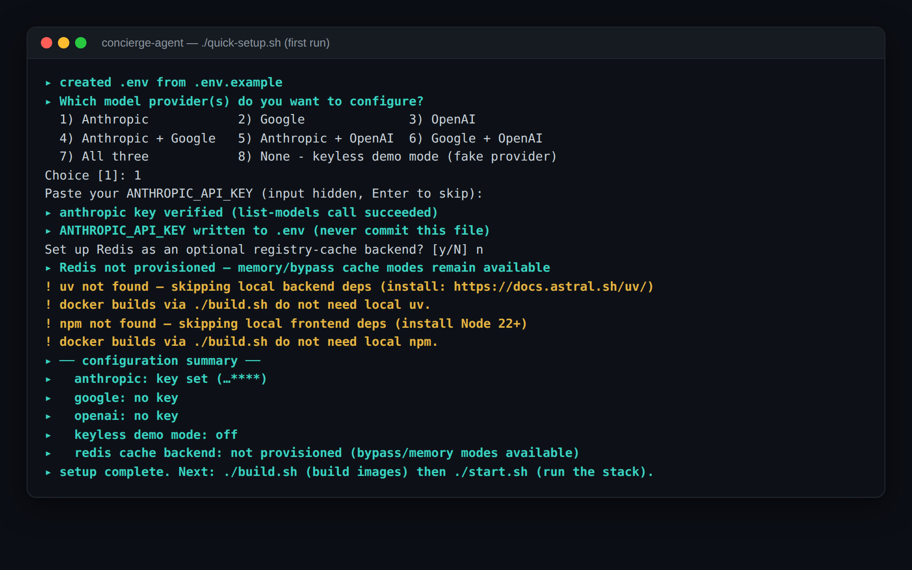
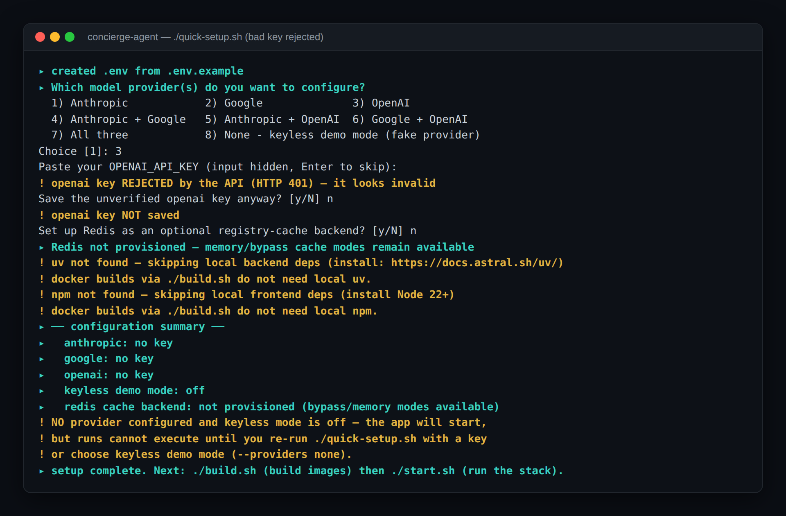
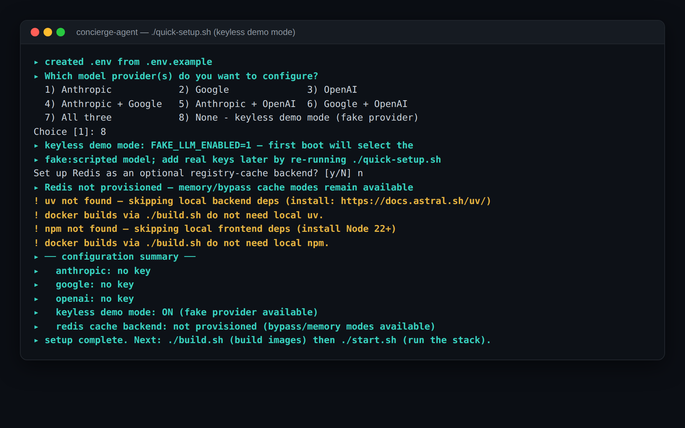
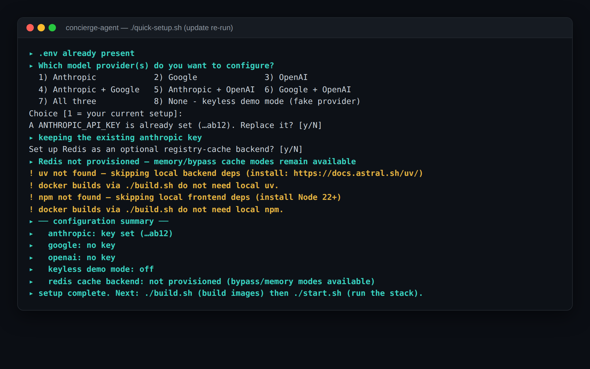
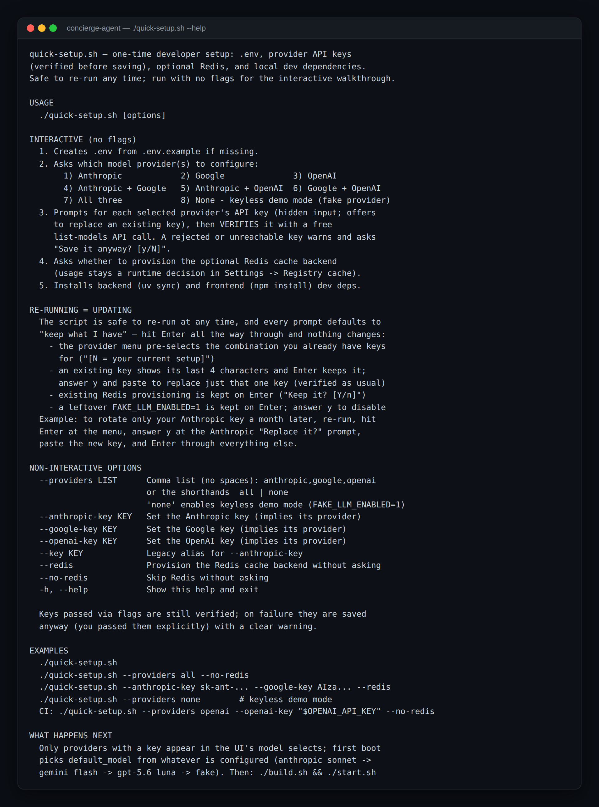
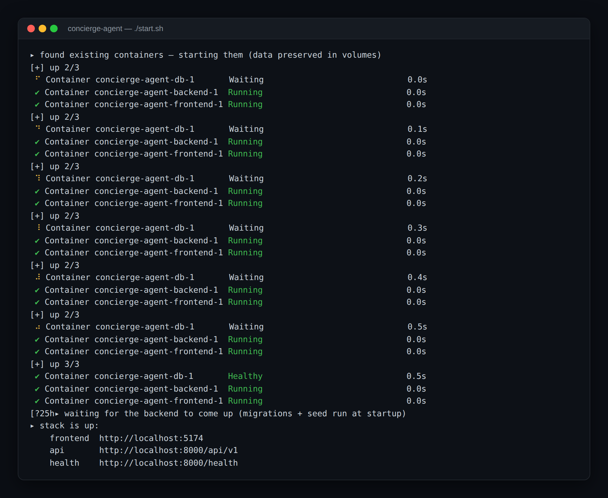

# Quick Start

Everything below is driven by **eight** idempotent scripts at the repo root — `quick-setup.sh`, `build.sh`, `start.sh`, `stop.sh`, `decom.sh`, and the M53 operations trio `deploy.sh`, `backup.sh` and `restore.sh` — so you should rarely need raw `docker compose` commands. Full operational detail lives in [docs/operations/runbook.md](./docs/operations/runbook.md).

## Prerequisites

- **Docker + Docker Compose** (the whole stack runs in containers)
- An API key for **at least one** provider — Anthropic, Google, OpenAI, **OpenRouter**, or any OpenAI-compatible gateway via `CUSTOM_GATEWAY_*`; any combination works (or none: see keyless mode below). `quick-setup.sh` prompts for the first three; OpenRouter and the custom gateway are set by hand in `.env` (`OPENROUTER_API_KEY`, or `CUSTOM_GATEWAY_BASE_URL` / `_API_KEY` / `_MODELS`) — every acceptance frame under `docs/acceptance/` was captured on `openrouter:qwen/qwen3.8-max`.
- For local development only (not needed to just run the app): Python 3.12 + [uv](https://docs.astral.sh/uv/), Node 20+

## 1. Set up

```bash
git clone <repo-url> && cd concierge-agent
./quick-setup.sh
```

What it does (safe to re-run any time — **re-running is how you update**: every prompt defaults to "keep what I have", so you can Enter through everything and change only what you answer differently, e.g. rotate one API key a month later by answering `y` at that key's "Replace it?" prompt and Enter everywhere else):

- creates `.env` from `.env.example` if missing
- asks **which model provider(s) you want**: Anthropic, Google, or OpenAI alone; any pair; all three; or none (keyless demo mode). OpenRouter and the custom gateway are not on this menu — add them to `.env` afterwards and they appear in the Settings model selects like any other configured provider.
- prompts for each selected provider's API key (hidden input; offers to overwrite an existing value), then **verifies the key with a free list-models API call** before saving — a rejected or unreachable key gets a clear warning and a "save it anyway?" choice
- asks whether to provision the **optional Redis cache backend** upfront (whether the app *uses* it stays a runtime Settings decision — the default cache mode never touches Redis)
- installs local dev dependencies (backend `uv sync`, frontend `npm install`)

**Keys live in `.env`, not in your shell.** `.env` is gitignored, so it is the safe place for them and the only copy compose reads — `docker-compose.yml` passes every provider key through as `${VAR:-}`. A key exported only in a terminal, or typed only into a container, disappears with that terminal or container and takes the run it was serving with it.

A first run looks like this — provider menu, hidden key input, live verification, and the closing configuration summary (key tail redacted here; the deps warnings appear only on machines without local `uv`/`npm`, which Docker-only users can ignore):



If a key is wrong or expired, verification catches it before it's saved — you decide what happens:



No keys at all? Option 8 provisions the keyless demo mode:



Only providers with a key appear in the UI's model selects (with their effort options), and **first boot picks the default model from whatever you configured**, in this order (`_FLAGSHIPS` in `backend/app/seed/loader.py`): Anthropic's Sonnet → Gemini Flash → GPT-5.6 Luna → **OpenRouter's Qwen 3.8 Max** → the custom gateway's first declared model → the fake provider. An explicitly saved `default_model` is never touched. You can re-mix models per role (orchestrator / planner / aggregator / sub agents) in Settings at any time.

> `./quick-setup.sh --help` still prints the older four-entry chain (anthropic → gemini → gpt → fake). The code above is the authority.

Re-running later to update is the same command — every prompt defaults to "keep what I have" (note the menu pre-selecting the current setup and Enter keeping the existing key):



`./quick-setup.sh --help` prints the full reference, including what each interactive step does:



Non-interactive flags:

```bash
./quick-setup.sh --providers anthropic,google       # or: openai / all / none
./quick-setup.sh --anthropic-key sk-ant-...         # implies its provider
./quick-setup.sh --google-key AIza... --openai-key sk-...
./quick-setup.sh --key sk-ant-...                   # legacy alias for --anthropic-key
./quick-setup.sh --redis | --no-redis               # Redis without asking
```

**No API key at all?** Choose option 8 (or `--providers none`): it sets `FAKE_LLM_ENABLED=1`, and first boot selects the scriptable `fake:scripted` model automatically — runs, SSE streaming, HITL, and both orchestrator modes all work without any provider key.

## 2. Build

```bash
./build.sh
```

Builds the backend and frontend Docker images. Re-run after pulling code changes.

## 3. Start

```bash
./start.sh
```

- errors out early if Docker isn't running
- creates or resumes the stack (`db`, `backend`, `frontend`); missing images are pulled/built
- **first run**: creates the database schema and loads seed data automatically — the two stdio MCP servers (`fetch`, `filesystem`, registered inactive and connected in the background), five native skills, ten native tools, and three sub agents (`research-concierge`, `workspace-reporter`, `workspace-warden`)
- **later runs**: resumes with all your data intact (named volumes)
- waits for backend health, then prints the URLs



Then open:

| What | Where |
|---|---|
| Admin UI | `http://localhost:${FRONTEND_PORT}` (default **5173**) |
| API | the port compose published from `BACKEND_PORT_RANGE` (default range **8000-8010**, so **8000** for a single replica) — `./start.sh` prints it, or ask `docker compose port backend 8000` |
| Interactive API docs | `/docs` on that same API port — and `/openapi.json` is the authoritative list of every endpoint |

First things to try: send a prompt in **Chat**, watch the live run trace, then walk the eleven-step acceptance script in [spec.md §14](./spec.md). A task-oriented tour of every page is in [docs/user-guide.md](./docs/user-guide.md).

## 4. Stop

```bash
./stop.sh
```

Stops the containers. **All data is preserved** — registries, runs, settings, checkpoints. `./start.sh` picks up exactly where you left off.

## 5. Deploy, back up, restore (M53)

Three more idempotent scripts, for a stack that is already running:

```bash
./deploy.sh                 # readiness-first roll: rebuild, drain the old backend, roll, then the frontend
./backup.sh                 # pg_dump + a workspace tarball into ./backups
./restore.sh <dump>         # timed restore drill — prints the measured RTO
```

`deploy.sh` sends `SIGUSR1` first, so `/ready` reports 503 while the port is still open: new runs are refused, streams the process cannot serve are closed with a reconnect hint, and open chat streams reconnect on their own with `Last-Event-ID` without duplicating a word. Procedure and numbers: [docs/operations/backup-restore.md](./docs/operations/backup-restore.md) and [scaling.md](./docs/operations/scaling.md).

## 6. Decommission (destructive)

```bash
./decom.sh        # asks for confirmation
./decom.sh -y     # skips the confirmation
```

Dismantles everything: containers, network, **and the data volumes** — registries, run history, checkpoints, workspace files. The next `./start.sh` is a clean slate (fresh schema, seeds reloaded). Images are kept — rebuild with `./build.sh` only after code changes.

## Optional: Redis cache backend

The registry cache ships as `memory` (the in-process, event-invalidated cache) and can be flipped live in Settings between `memory`, `bypass` (direct DB reads — the rollback lever) and `redis` — no restart. To make `redis` selectable:

1. provision it (`./quick-setup.sh --redis`, or set `REDIS_URL` in `.env` yourself)
2. start the profile: `docker compose --profile redis up -d`
3. flip **Settings → Registry cache → redis** (the save pings Redis and rejects if unreachable)

## Common issues

| Symptom | Fix |
|---|---|
| `./start.sh` says Docker isn't running | Start Docker Desktop / the docker daemon, re-run |
| Port already in use | Change **`BACKEND_PORT_RANGE`** (not `BACKEND_PORT` — compose publishes the backend from the range) and/or `FRONTEND_PORT` in `.env`, then `./stop.sh && ./start.sh` so the containers are recreated with the new mapping. `BACKEND_PORT` is only the port used *outside* compose (the `uvicorn --port` of the fast dev loop, and `VITE_API_BASE_URL`). |
| Runs fail with provider/credit errors | Check the key in `.env`; error text is shown verbatim on the run in the Runs page |
| Selecting redis cache mode is rejected | `REDIS_URL` unset or Redis not running — see the Redis section above |
| Something else | [docs/operations/troubleshooting.md](./docs/operations/troubleshooting.md) |

## Where to go next

- **Use the app**: [docs/user-guide.md](./docs/user-guide.md)
- **Operate it**: [docs/operations/runbook.md](./docs/operations/runbook.md) · [configuration reference](./docs/operations/configuration.md)
- **Understand it**: [docs/architecture/overview.md](./docs/architecture/overview.md)
- **Develop on it**: [docs/development/local-development.md](./docs/development/local-development.md) · [contributing](./docs/development/contributing.md)
- **Everything**: [docs/README.md](./docs/README.md)
