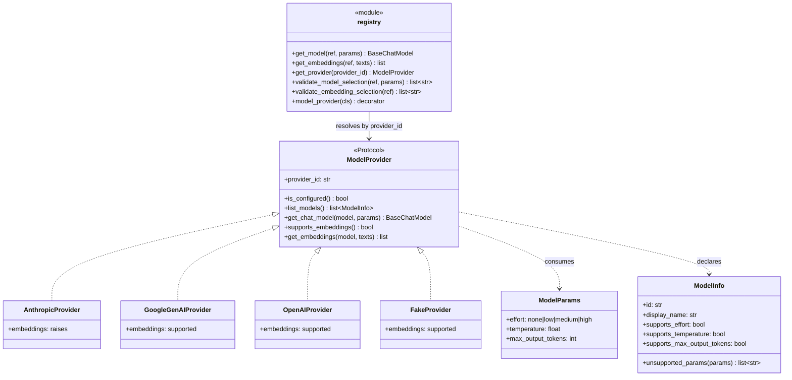
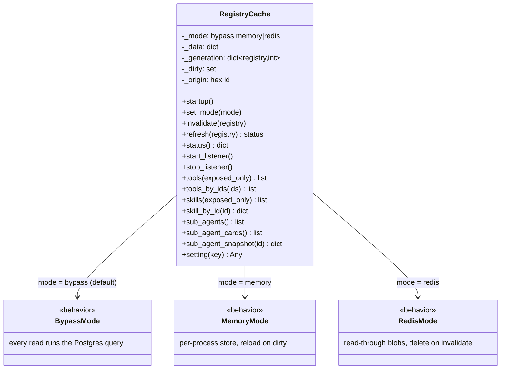
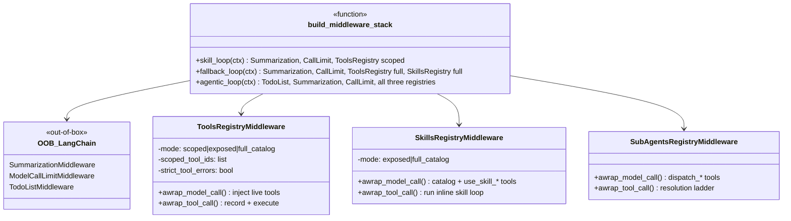
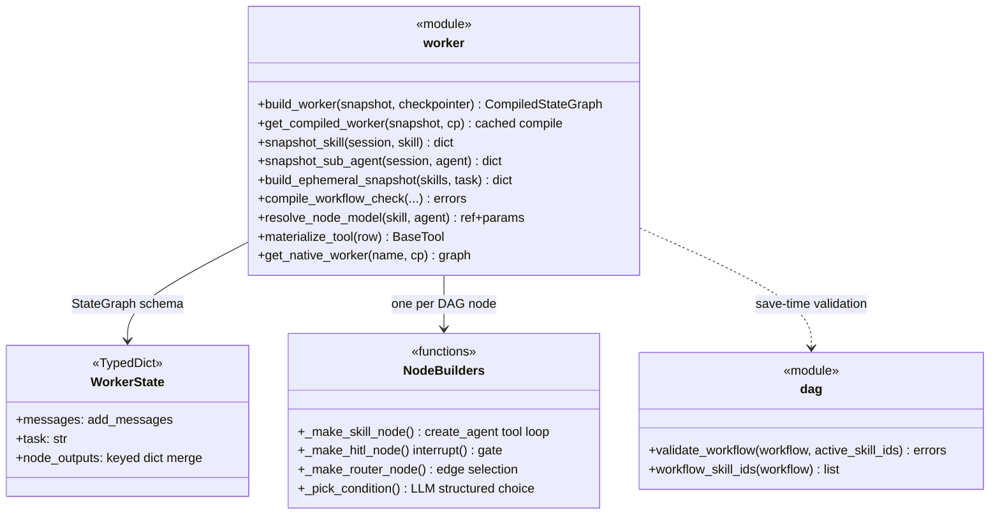
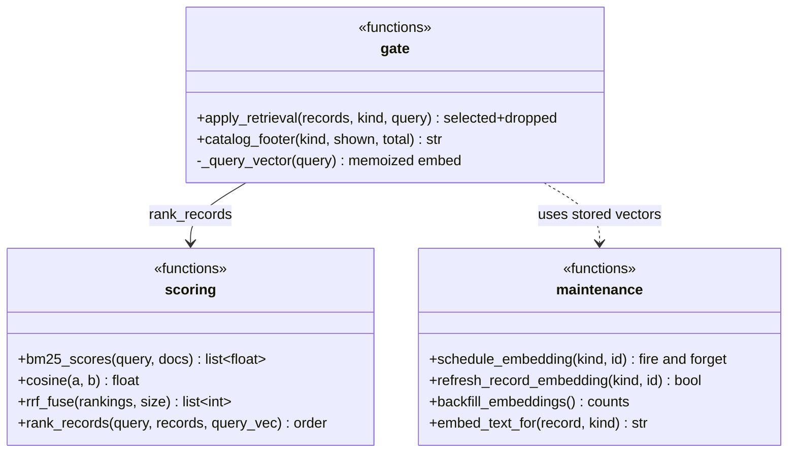

# Internal Components

This document covers the load-bearing internal designs of the backend: the model-provider port, the registry cache, the middleware stack, the worker factory, and the retrieval pipeline. Every claim is grounded in the referenced modules.

## Provider port (`backend/app/llm/`)

`backend/app/llm/` is the only module tree allowed to import provider SDKs or LangChain provider packages (spec §2.1). Everything else calls `get_model("provider:model")` and receives a `BaseChatModel`.

- **Port** (`backend/app/llm/port.py`): `ModelProvider` is a `runtime_checkable` Protocol. `ModelParams` is the normalized configuration (Pydantic, `extra="forbid"`); `ModelInfo` declares per-model parameter support so an unsupported combination is rejected at save time (`validate_model_selection`) and again at `get_chat_model` time.
- **Registry** (`backend/app/llm/registry.py`): adapters self-register via the `@model_provider` class decorator into a module-level dict keyed by `provider_id`. `get_model(ref)` splits `"provider:model"` with `parse_model_ref` and delegates to the adapter; unknown providers raise `UnknownProviderError`. `register_builtin_providers()` (called from `create_app`) imports `adapters.py` and `fake.py` so the decorators run.
- **Effort mapping** (`backend/app/llm/adapters.py`): each adapter maps the normalized `effort` onto its provider's knob. Anthropic: extended-thinking `budget_tokens` (`low=1024`, `medium=8192`, `high=32768`), except the Claude 5 family which gets `thinking={"type": "adaptive"}` plus `output_config={"effort": ...}`. Google: `thinking_budget` tokens (`none=0` disables thinking). OpenAI: `reasoning_effort` strings, and any effort flips the call onto the Responses API (`use_responses_api=True`) because reasoning + function tools are rejected on `/v1/chat/completions`.
- **Embeddings**: `supports_embeddings()` defaults to `False` on `ModelProviderBase`, and the default `get_embeddings` raises `EmbeddingsNotSupportedError` — that is Anthropic's behavior. `GoogleGenAIProvider` and `OpenAIProvider` implement it via their LangChain embeddings classes; `FakeProvider` (`backend/app/llm/fake.py`) returns deterministic bag-of-tokens vectors so ranking tests exercise real cosine math. Consumers degrade to lexical-only retrieval when embeddings are unavailable.
- **Fake provider**: registered through the same port (`get_model("fake:scripted")`), gated by `FAKE_LLM_ENABLED`, with a FIFO script queue — tests never touch a provider SDK and never bypass the port.

## RegistryCache (`backend/app/registry_cache.py`)

Every registry and settings read on the run path goes through the singleton `RegistryCache` (`get_cache()`).

- **Registries**: four logical entries — `tools`, `skills`, `sub_agents`, `settings` — each loaded wholesale by `_load_registry()` (all non-deleted rows, all statuses; consumers filter, mirroring the pre-cache SQL semantics).
- **Modes** are selected live by the `registry_cache_mode` setting. `bypass` is stateless; `memory` keeps per-registry data with reload-on-dirty; `redis` stores JSON blobs under `concierge:cache:*` (requires `REDIS_URL`, env-only). A settings PATCH flips the mode without restart because dirtying `settings` re-reads the mode.
- **Generation counters and dirty marking**: `_mark_dirty()` bumps `_generation[registry]` and adds it to `_dirty`; the next `_ensure()` reloads the whole registry (registries are small, so full reload can never leave a stale embedded relationship). Dependency propagation is built in: dirtying `tools` dirties `skills` (skill records embed tool rows), and dirtying `skills` dirties `sub_agents`.
- **`invalidate` vs `refresh`**: `invalidate(registry)` marks dirty locally and notifies peers — visibility is "next model call" (lazy reload). `refresh(registry)` is the operator-forced eager reload behind the §8.7 buttons: invalidate, then `_ensure(force=True)` (in bypass mode it just counts rows). There are deliberately no TTLs — an entry is current or invalidated; every registry write path calls `invalidate()` before returning.
- **Peer sync**: `invalidate` broadcasts `pg_notify('registry_cache_inv', '{origin}:{registry}')`. `start_listener()` opens a dedicated asyncpg LISTEN connection; the callback ignores its own origin id and calls `_mark_dirty()` (local-only — which makes notification loops impossible by construction). All of it is best-effort: single-replica correctness never depends on the listener.
- **Typed read surface**: `tools(exposed_only=...)` / `skills(exposed_only=...)` filter to active rows and optionally to `direct_exposure`; `tools_by_ids` is order-preserving and active-only (mirrors `factory.resolve_tools_by_ids`); `sub_agents()` preserves `created_at` order (rung-3 precedence relies on it); `sub_agent_snapshot(id)` assembles the same shape as `factory.snapshot_sub_agent` from cached registries; `setting(key)` serves merged settings.

## Middleware stack (`backend/app/orchestrator/middleware.py`)

`build_middleware_stack(context)` is the single composition helper (spec §7.0); the context dataclass type selects the stack. Out-of-box LangChain middlewares come first; the only custom middlewares are the three registry projections.

- **`SkillLoopContext`** — used by every skill loop: DAG skill nodes (`factory/worker.py`), rung-1 inline execution and fallback-invoked skills (`orchestrator/ladder.py`). Stack: `SummarizationMiddleware`, `ModelCallLimitMiddleware(run_limit=max_tool_iterations + 1, exit_behavior="error")`, and `ToolsRegistryMiddleware` in **scoped** mode with the skill's bound tool ids. Skill loops never get the Skills/SubAgents middlewares — §3.3 isolation is enforced structurally, not by prompt.
- **`FallbackLoopContext`** — the self-service full-catalog fallback (`orchestrator/graph_mode.py`): Summarization + call limit + `ToolsRegistryMiddleware(mode="full_catalog")` + `SkillsRegistryMiddleware(mode="full_catalog")` (exposure flags ignored; skill handlers stay isolated).
- **`AgenticLoopContext`** — the agentic orchestrator loop (`orchestrator/agentic_mode.py`): `TodoListMiddleware`, Summarization, a wider call limit (`max(max_tool_iterations * 3, 12)`), then all three registry middlewares in exposure-gated mode. A `use_full_catalog` escalation flips the run's `full_catalog` flag, which `_effective_mode()` / `_effective_full()` read live mid-loop.
- **The three projections** are stateless over Postgres: they re-resolve from the `RegistryCache` at every model call (`awrap_model_call`), which is what makes registry edits visible on the next model call of a running loop. `ToolsRegistryMiddleware` materializes live tool objects (with `apply_retrieval` gating the exposed-mode catalog) and records `tool_call` steps around execution — strict loops raise `ToolExecutionFailed` (node error-edge semantics), non-strict loops return an error `ToolMessage` so the loop can self-correct. `SkillsRegistryMiddleware` injects a skills catalog into the system prompt plus `use_skill_*` tools whose handlers run the isolated inline skill loop. `SubAgentsRegistryMiddleware` builds `dispatch_*` tools from sub-agent cards; the handler runs the resolution ladder, and `interrupt()` raised inside the dispatched graph propagates to the parent for HITL (all three re-resolve inside `awrap_tool_call` because HITL resume replays the tool call before any model call).

## Worker factory (`backend/app/factory/`)

`build_worker(snapshot, checkpointer)` compiles a workflow DAG snapshot into a LangGraph `CompiledStateGraph` (spec §6).

- **Snapshots**: dispatch freezes configuration. `snapshot_sub_agent` captures the sub-agent header, the raw `workflow` jsonb, and a `snapshot_skill` per referenced skill (bound tools included, soft-deleted tools excluded). `build_ephemeral_snapshot` builds a rung-4 dynamic worker: selected skills as a sequential `step-N` chain, first skill's persona leading, never cached.
- **Node types**: the DAG has exactly two node types, `skill` and `hitl` (`NODE_TYPES` in `dag.py`). There are no dedicated branch/parallel node types — **branching** is expressed as conditional edges (`condition` on a success edge) and **parallelism** as fan-out (multiple success edges from one node). Joins use LangGraph deferred nodes: `build_worker` counts incoming edges and compiles any node with more than one as `defer=True`, so it runs once every *reachable* upstream branch completes and untaken branches never deadlock a join (spec §3.5).
- **Skill nodes** (`_make_skill_node`): at node-execution time, resolve the model (`resolve_node_model`: skill override → sub-agent override → settings defaults, via `get_model`), assemble the prompt in the §6 order (`assemble_skill_prompt`: sub-agent persona, skill persona, skill instructions, node instructions, shared `tool_guidance` prompt file), build the scoped middleware stack, and run a LangChain `create_agent` tool loop. `max_tool_iterations` resolves per skill: the skill's own `max_tool_iterations` column if set, else the `max_tool_iterations` setting (`_max_tool_iterations`). Failures are captured as `{"status": "error"}` node outputs, not raised.
- **Router nodes**: every DAG node is followed by a synthetic `__route__{node_id}` node that enforces error semantics — error output takes the (at most one) error edge or raises `NodeExecutionError` (run fails), a HITL denial routes to END, and multiple conditional edges are resolved by `_pick_condition` (structured output `ConditionChoice` from the sub-agent's model). Decisions are recorded in state under `route:{node_id}`.
- **HITL nodes** (`_make_hitl_node`): call LangGraph `interrupt()` with the prompt (and optional form questions); the decision payload (`approve`/`deny`, note, answers) becomes the node output. Persistence rides the shared `AsyncPostgresSaver` checkpointer from `backend/app/db.py`.
- **Compile cache**: `get_compiled_worker` memoizes by `(sub_agent_id, updated_at, id(checkpointer))` — an edited agent recompiles because `updated_at` changes. `compile_workflow_check` makes save-time equal compile-time: a full `build_worker` with no invocation, errors returned as validation messages. Native sub-agents bypass the factory entirely (`get_native_worker` calls the registered build callable).

## Retrieval (`backend/app/retrieval.py`)

Progressive-disclosure retrieval (spec §7.4) ranks registry catalogs down to the top-K records before injection into a model call. Scoring is in-process over the cache snapshot — never a per-call DB query.

- **Pipeline**: `rank_records` builds up to two rankings — Okapi BM25 (`bm25_scores`, dependency-free, over `name + description`) and cosine over stored record embeddings when a query vector exists — then fuses them with reciprocal-rank fusion (`rrf_fuse`, k = 60). If neither signal exists the original order is the identity.
- **The gate**: `apply_retrieval(records, kind=...)` is where everything funnels. It is the identity when `retrieval_enabled` is off, when the catalog is at or below `retrieval_threshold`, or when there is no query (the run context's `query_text`). Otherwise it keeps the top `retrieval_top_k`, re-adds **pinned ids** (entities already used in this run bypass ranking), logs the drop count, and returns `(selected, dropped)` so callers can render `catalog_footer` — the honesty line telling the model it sees a slice and can call `use_full_catalog`.
- **Where it gates**: `ToolsRegistryMiddleware._resolve` applies it only in `exposed` mode (scoped loops are pinned contracts; full-catalog is the deliberate escape hatch past ranking); `SkillsRegistryMiddleware._snapshots` applies it when not in full-catalog mode; `SubAgentsRegistryMiddleware._cards` always applies it to the dispatch card list. The planner consumes the same gate for its catalogs.
- **Embedding maintenance**: query vectors come from the `embedding_model` setting through the provider port (`get_embeddings`), memoized in a small LRU; failure degrades to lexical-only. Record vectors are written by `refresh_record_embedding` (hash-guarded, never raises, invalidates the cache on change), triggered fire-and-forget from registry writes (`schedule_embedding`) and at startup (`backfill_embeddings`, a background task in the `main.py` lifespan).

---

See also: [overview.md](overview.md) · [data-model.md](data-model.md) · [runtime-flows.md](runtime-flows.md)
