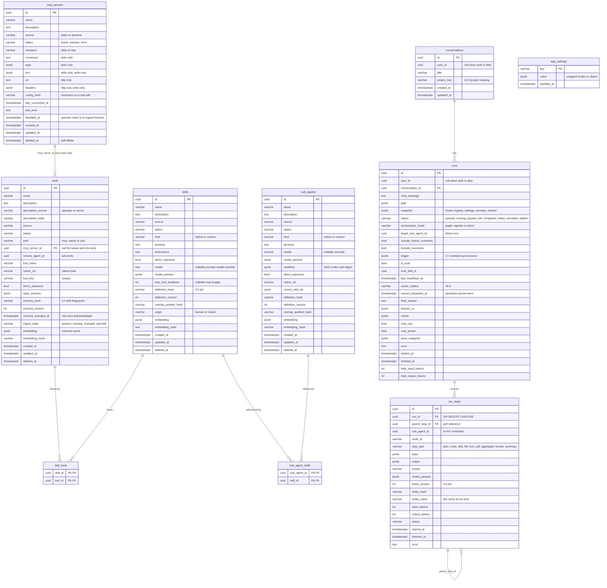

# Data Model

The Concierge Agent's Postgres schema holds **40 application tables** — 38 mapped SQLAlchemy classes in `backend/app/models/` plus the two join tables — and, alongside them, **three LangGraph checkpoint tables** whose schema the `langgraph-checkpoint-postgres` package owns.

This page is organised by domain: the ERD below diagrams the **registry + run core** (the ten tables of the original schema, with their columns as they stand today), and the sections after it index every other table with its purpose, owning module and spec section. It is derived from the ORM models and cross-checked against the migration chain.

## Migration chain

29 migrations, one linear chain, run automatically at startup under the boot lock:

| # | Migration | What it added |
|---|---|---|
| 1 | `ebf05a862e33_initial_schema` | the ten core tables: `mcp_servers`, `tools`, `skills`, `skill_tools`, `sub_agents`, `sub_agent_skills`, `conversations`, `runs`, `run_steps`, `app_settings` |
| 2 | `d2a378047698_add_runs_answer_ui` | `runs.answer_ui` (jsonb) |
| 3 | `f31a9c04e7d1_add_registry_embeddings` | `embedding` + `embedding_hash` on `tools`, `skills`, `sub_agents` (§7.4) |
| 4 | `a8b3c9d1e2f4_add_skill_max_tool_iterations` | `skills.max_tool_iterations` (§3.3 per-skill loop budget) |
| 5 | `b7c4d2e9f1a3_add_runs_charts` | `runs.charts` — `render_chart` specs, formatter-independent |
| 6 | `c9e1f5a2d7b8_add_direct_sub_agent_invocation` | `sub_agents.direct_exposure`, `runs.target_sub_agent_id` (§7.5) |
| 7 | `d4f7b2c8e1a9_add_run_history_summary_flag` | `runs.include_history_summary` (§7.5) |
| 8 | `a1b2c3d4e5f6_memory_layers` | the pgvector extension and the §16.1 memory tables |
| 9 | `b2c3d4e5f6a7_runs_include_memories` | `runs.include_memories` (§16.3) |
| 10 | `c3d4e5f6a7b8_digest_compaction` | `run_digests` compaction columns (§16.7) |
| 11 | `d4e5f6a7b8c9_ambient_substrate` | the §17.1 ambient tables + `runs.trigger` / liveness columns |
| 12 | `e5f6a7b8c9d0_ambient_decision_column` | the fire/hold decision record on `ambient_events` (§17.3) |
| 13 | `f6a7b8c9d0e1_ambient_delivery_plane` | `deliveries`, `ambient_policies` (§17.5/§17.6, M23) |
| 14 | `g7b8c9d0e1f2_memory_context_pack` | `conversations.project_key`, routine memory columns (§18.2, M27) |
| 15 | `h8c9d0e1f2a3_delivery_channels` | the per-channel send ledger on `deliveries` (§18.4, M29) |
| 16 | `i9d0e1f2a3b4_memory_communities` | `memory_communities` (§18.6, M31) |
| 17 | `j0e1f2a3b4c5_evals` | `eval_datasets`, `eval_cases`, `eval_runs`, `eval_results` (§15, M32) |
| 18 | `k1f2a3b4c5d6_auth_tenancy` | `users`, `auth_sessions`, `user_id` on the eight work tables (§18.8, M34) |
| 19 | `m2a3b4c5d6e7_a2a_substrate` | `remote_agents`, `a2a_tasks` (§19.2, M37) |
| 20 | `n3b4c5d6e7f8_delivery_salience` | the salience record + `seen_at` on `deliveries` (§17.5, M42) |
| 21 | `o4c5d6e7f8a9_memory_tombstones` | `memory_tombstones` (§16.1, M44) |
| 22 | `p5d6e7f8a9b0_tombstone_token_hashes` | the distinctive-token hashes for the M44 hybrid gate |
| 23 | `q6e7f8a9b0c1_hot_path_indexes` | the five missing hot-path indexes (M50) |
| 24 | `r7f8a9b0c1d2_tool_ingest_state` | `tools.ingest_state` — re-ingest preserves operator intent (M53) |
| 25 | `s8g9h0i1j2k3_m54_scale` | `replicas`, `job_clock`, `rate_buckets`, `job_usage`, `runs.owner_replica` / `cancel_requested_at`, the typed per-dimension embedding columns and their HNSW indexes (§18.9, M54) |
| 26 | `t9h0i1j2k3l4_m54_memory_fk_indexes` | indexes on the self-referencing foreign keys in `memories` |
| 27 | `u0i1j2k3l4m5_tool_schema_fingerprint` | `tools.schema_hash` / `schema_version` / `schema_changed_at`, `run_steps.entity_version` / `entity_hash` (§3.2, §3.6) |
| 28 | `v1j2k3l4m5n6_hardening_wave` | definition fingerprints and versions on the registries, `run_steps.entity_name` / `model_params`, `runs.cost_usd` / `cost_priced` / `price_snapshot`, the MCP config hash, the proposal `origin` |
| 29 | `w2k3l4m5n6o7_third_reading` | two backfills the hardening-wave migration left out (pre-`origin` proposals stamped `mined`; description fingerprints re-trimmed) |

## Entity-relationship diagram — the registry and run core

There is no `run_events` table: live run activity streams over SSE from an in-memory, bounded, TTL-evicting `RunEventBus` (`backend/app/orchestrator/context.py`), with `run_steps` as the durable trace and the `runs` row as the record a reconnecting client resolves from (M53).

## Registries: `mcp_servers`, `tools`, `skills`, `sub_agents`, `remote_agents`

All five registry tables inherit the abstract `RegistryRecord` base (`backend/app/models/base.py`): `id` (uuid, immutable — the spec forbids id rewrites), `name` (indexed, non-unique), `description`, `source`, `status`, `created_at`/`updated_at`, and `deleted_at` for **soft delete**. Rows are never hard-deleted through the registry APIs; every read path filters `deleted_at IS NULL`.

- **`source`** is `static` or `dynamic`. Static rows are seeded from code (`backend/app/seed/loader.py`); the API rejects definition writes to them — only `status` and `direct_exposure` are togglable (spec §4). Dynamic rows are user-created and fully editable.
- **`status`** is `active | inactive | error`. Only `active` rows are surfaced to the run path (the `RegistryCache` typed reads filter on it).
- **`direct_exposure`** (on `tools`, `skills` and `sub_agents`) gates what the orchestrator sees in "exposed" mode and which sub agents may be invoked directly (§7.5); the full-catalog fallback ignores the flag on tools and skills.
- **`tools.tool_key`** is the one **unique** registry constraint (`ix_tools_tool_key`, unique index). It is the stable LLM-facing identity; `sanitize_tool_name(tool_key)` becomes the bound tool name. `kind` discriminates `mcp` (has `mcp_server_id`), `native` (has `native_ref`) and `a2a` (has `remote_agent_id`, projected from a card skill). `input_schema` (jsonb) holds the JSON Schema for tool arguments, and `schema_hash`/`schema_version`/`schema_changed_at` carry the §3.2 drift fingerprint. `ingest_state` records why a tool is out of service (`present` · `missing` · `changed` · `agentoff`) so a re-ingest never silently undoes an operator's decision.
- **`skills`** carry the prompt material (`persona`, `instructions`), an optional per-skill `model`/`model_params` override (null inherits from the invoking sub-agent, then settings defaults), a nullable `max_tool_iterations` loop-budget override, and the §3.6 `definition_hash`/`definition_version` a run pins. `origin` (`human` | `mined`) marks a §16.5 mined proposal, which must be judged before it can be activated. Bound tools live in the `skill_tools` join table; binding is availability — a skill loop sees exactly its bound tools.
- **`sub_agents.workflow`** (jsonb) is the workflow DAG: `{"nodes": [...], "edges": [...]}` with node types `skill` and `hitl`, validated at save by `backend/app/factory/dag.py` and compile-checked by the worker factory. `covers_skill_ids` (jsonb array) supports rung-3 resolution precedence; `sub_agent_skills` is maintained from the distinct skill ids in the DAG. `native_ref` points at a code-registered graph builder for `kind = 'native'` agents.
- The join tables `skill_tools` and `sub_agent_skills` have composite primary keys and plain FKs (no `ON DELETE CASCADE` — deletes are soft, and the API blocks deleting a skill with dependents with a 409).

## MCP and A2A: `mcp_servers`, `remote_agents`, `a2a_tasks`

An `mcp_servers` row is a connection definition plus health state. `transport` selects which column group applies: `stdio` uses `command`/`args`/`env`; `http` uses `url`/`headers`. `env` and `headers` are **write-only** (M52): reads are masked, `***` keeps the stored value and null removes it, and `env:VAR` indirection resolves at connect time. `config_hash` distinguishes a real edit (which reconnects) from a masked round-trip (which does not). `last_connected_at` and `last_error` are written by the `McpManager` health loop. Tools discovered from a server are rows in `tools` with `kind = 'mcp'`; a dead server is *not* cascaded into its tools — tool calls fail at invocation time via the lazy MCP proxy, which is what routes a node's error edge.

`remote_agents` is the same shape for §19 A2A counterparties: the fetched Agent Card, write-only per-scheme credentials, `auth_status`, the card version and refresh timestamps. `a2a_tasks` is the bookkeeping row per outbound task — remote task id, `call_key` for the adopt-or-send replay rule, state, park status and the last polled result.

## Runs and tracing: `conversations`, `runs`, `run_steps`

- `conversations` groups `runs` (multi-turn chat); it carries a title, the owning `user_id` when auth is on, and an optional `project_key` that scopes §16.3 project memories.
- `runs` is one orchestrated request. `plan` (jsonb) stores the planner output; `snapshot` (jsonb) freezes the dispatched configuration — the sub-agent header and workflow DAG, embedded skill snapshots, the `settings` and `prompts` hashes, the planner's `context` surface, `catalog_calls`, and the pinned registry records with their versions — so a trace is readable against the registry as it *was*. `answer_ui` (jsonb) stores the formatter's artifact, `charts` the `render_chart` specs, and `cost_usd`/`cost_priced`/`price_snapshot` the cost stamped at finish with the prices it was computed from (a later price change never rewrites history). Token totals aggregate from steps.
  **`status` is one of `queued | running | paused_hitl | completed | failed | cancelled | stalled`.** `queued` (M51) is a first-class row: admission is full and the run is waiting for a slot. `stalled` (§17.4) is what the heartbeat reaper writes when a run's task goes silent — routed through the same finalisation as every other terminal status, so its steps close, it is priced, and its stream ends.
  **`orchestrator_mode` is `graph | agentic | direct`.** `owner_replica` names the process executing the run and `cancel_requested_at` is the persisted cancel intent any replica may write (§18.9) — no process ever writes a status it did not cause.
- `run_steps` is the trace tree: `parent_step_id` self-references for nesting (a `tool_call` under a `skill` step, a native-subgraph step under its tool call). **`step_type` is one of `plan | route | skill | hitl | tool_call | aggregate | format | summary`** — `format` is the formatter's own call (counted once) and `summary` the §7.5 history-summary call. `entity_version`/`entity_hash`/`entity_name`/`model_params` pin what the step ran against (§3.6). `run_id` is the **only FK in the schema with `ON DELETE CASCADE`** — deleting a run removes its steps. `sub_agent_id` is a bare uuid column with no FK constraint, so traces survive registry deletion. `input`/`output` are jsonb payloads (tool args, truncated results, route decisions).

## Memory (§16) — 11 tables

| Table | What it holds |
|---|---|
| `memories` | L2 semantic facts/preferences/entities: text, kind, confidence, scope (`user` / `project` / `global`), `project_key`, owner, bi-temporal validity, supersession links, status (`active` / `quarantined` / `superseded` / `expired`), provenance |
| `memory_embeddings` | the embedding side-table keyed by `(ref_id, table_ref, model_key)` — see **Embeddings** below |
| `memory_entities` | canonical entity names extracted from memories |
| `memory_entity_links` | the entity graph edges recall hops across |
| `memory_communities` | §18.6 label-propagation communities with a member-set signature, so only changed communities re-summarize |
| `memory_tombstones` | M44 durable forgetting: metadata, normalized-hash and payload-token hashes of a forgotten memory (never its text), plus a suppression-only embedding copy destroyed with the tombstone |
| `run_digests` | L1 episodic: one row per completed run, plus the compaction rows that fold ranges of them |
| `conversation_rollups` | L1 rolling per-conversation summary |
| `plan_exemplars` | L3 procedural: a positively-signaled plan keyed by task text, with the reuse-vote lifecycle |
| `routing_stats` | L3 per-capability outcome statistics, consolidation-refreshed |
| `job_usage` | model tokens spent by work that is **not** a run (judges, digests, reflection, community summaries, extraction, embeddings) — the §3.7 cost model's other half |

## Ambient (§17/§18) — 8 tables

| Table | What it holds |
|---|---|
| `ambient_events` | one observed occurrence entering the trigger plane, with its fire/hold decision record and cascade guards |
| `routines` | a stored, trusted ambient work definition: trigger, allowlist, model ref, budgets, hashed fire token, quarantine status and reason |
| `standing_intents` | a typed, durable "tell me when…" row with its compiled rule and cadence state |
| `ambient_wakeups` | agent-scheduled self-wakeups (heartbeat sense H2) with clamps, caps and the done-guard |
| `pattern_instances` | partial composite-pattern matches; absence is an armed timer (§17.3a) |
| `deliveries` | the outbox row for anything ambient wants a human to see: tier, urgency, `skey` supersede lineage, `seen_at`, the per-channel send ledger with attempts/backoff/dead-letter, and the salience record |
| `ambient_policies` | the append-only category policy ledger — the latest row per category wins, every learner change is reversible from it |
| `user_presence` | the presence snapshot the pursuit oracle reads |

## Evals (§15), auth (§18.8/§20) and the cluster (§18.9) — 11 tables

| Table | What it holds |
|---|---|
| `eval_datasets` / `eval_cases` | an uploaded dataset and its cases (input, expectation, grader) |
| `eval_runs` / `eval_results` | a batch run with its config snapshot, and one result per case with the grade and the judge's verdict |
| `users` / `auth_sessions` | the builtin provider's identities (scrypt) and bearer sessions (sha256 at rest, `AUTH_SESSION_TTL_H` lifetime). Both are dark unless `AUTH_ENABLED` |
| `replicas` | one row per live process, refreshed every heartbeat; `GET /replicas` serves it |
| `job_clock` | `last_run_at` per periodic job — the interval is a cluster property, so a restart re-runs nothing |
| `rate_buckets` | the §18.8 token bucket shared by every replica; idle keys evicted hourly |

## Settings: `app_settings`

A key-value store read live at runtime (spec §3.7): `key` (varchar 64) is the primary key and `value` is jsonb wrapping the actual scalar or object. Defaults live in code (`DEFAULTS` in `backend/app/settings_store.py`, **122 keys**); the table stores only overrides, and reads merge defaults with stored rows. Provider API keys are deliberately absent — they are env-only. Every key has a Settings control, asserted by a test that enumerates the live key set. The full reference is [operations/configuration.md](../operations/configuration.md).

## Embeddings

Two different mechanisms, for two different jobs:

- **Registry retrieval (§7.4)** — migration `f31a9c04e7d1` added `embedding` (jsonb array of floats) and `embedding_hash` to `tools`, `skills` and `sub_agents`. They are maintained best-effort on the write path (`schedule_embedding` in `backend/app/retrieval.py`) and backfilled at startup by `backfill_embeddings()`. `embedding_hash` is a SHA-256 of `"{model}:{embed_text}"`, so re-embedding is skipped when neither the record text nor the embedding model changed. Cosine scoring for ranking happens **in-process over the cache snapshot** — a registry is at most a few hundred rows, so there is no index and no per-call query.
- **Memory recall (§16.1)** — `memory_embeddings` is a real pgvector table. The vector lives in **one typed column per supported dimension** (`emb_64` … `emb_3072`, `halfvec` above pgvector's 2000-dim index ceiling), chosen from the model key's `@dims` suffix, and **each column carries a real HNSW cosine index** (migration `s8g9h0i1j2k3`). Several dimensions coexist under different `model_key`s, which is what makes the §16.1 zero-downtime embedding-model switch true: the backfill job (`app/memory/lifecycle.embedding_backfill`) fills the active key's column in the background and recall flips by querying it. Rows whose dimension has no column are lexical-only.

## LangGraph checkpoint tables

Durable graph state for HITL pause/resume is handled by LangGraph's own `AsyncPostgresSaver` (see `get_checkpointer()` in `backend/app/db.py`). `checkpoints`, `checkpoint_blobs` and `checkpoint_writes` are created by `checkpointer.setup()` during app startup and are **not** defined in this application's SQLAlchemy metadata or Alembic history — their schema is owned by the `langgraph-checkpoint-postgres` package, so they are intentionally not diagrammed here. Checkpoint threads are keyed by run id.

They are, however, **owned by this application operationally**: deleting a run and purging run history both remove the matching checkpoint rows (`_purge_checkpoints` in `backend/app/api/runs.py`, all three tables), and `checkpoints` is one of the nine retention targets (`backend/app/retention.py`), purged narrowest-first so a checkpoint or a step is never orphaned by its run disappearing under a different window.

## Schema change workflow

One Alembic migration per schema change (`backend/alembic/versions/`, linear revision chain). Migrations run automatically at startup: the FastAPI lifespan in `backend/app/main.py` calls `_run_migrations()` (Alembic `command.upgrade(cfg, "head")` in a worker thread) **inside the boot advisory lock**, so N replicas migrate once, before seeding, checkpointer setup, and cache warm-up. There is no separate migration step in `docker compose up`. A rolling deploy needs expand/contract migrations — see [operations/scaling.md](../operations/scaling.md).

---

See also: [overview.md](overview.md) · [components.md](components.md) · [runtime-flows.md](runtime-flows.md) · [state-machines.md](state-machines.md)
