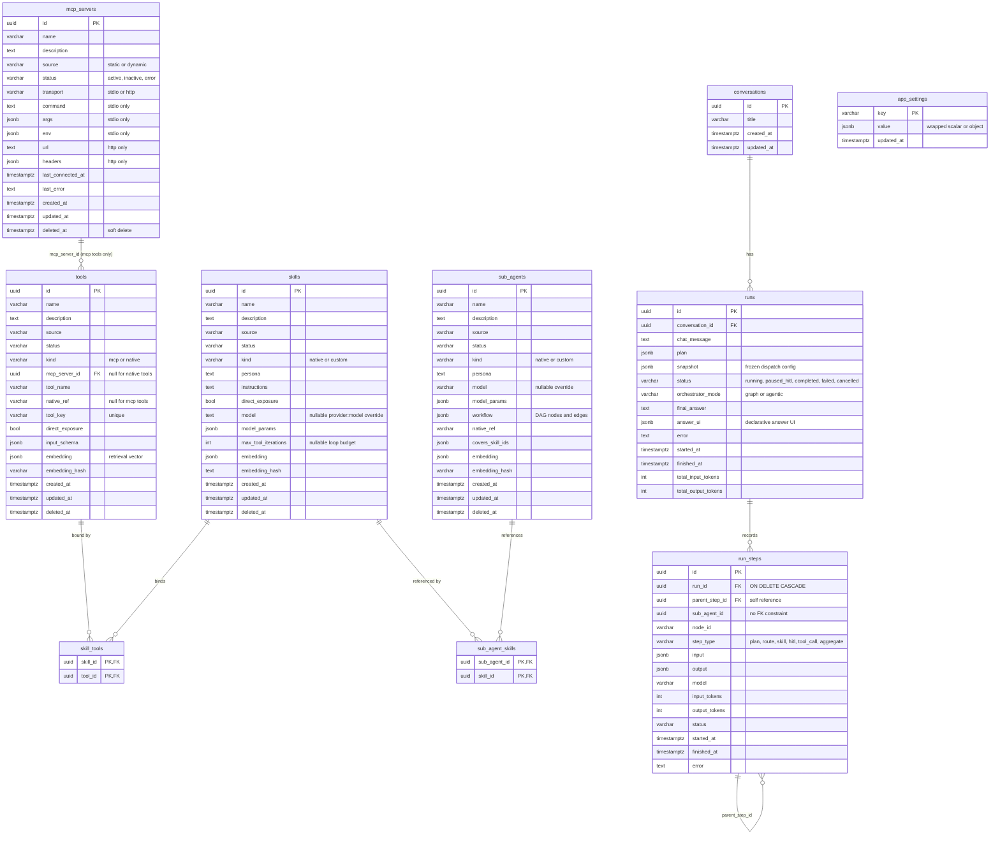

# Data Model

This document describes every table in the Concierge Agent Postgres schema. It is derived from the SQLAlchemy ORM models in `backend/app/models/` and cross-checked against the Alembic migrations in `backend/alembic/versions/`:

| Migration | What it added |
| --- | --- |
| `ebf05a862e33_initial_schema.py` | All ten application tables |
| `d2a378047698_add_runs_answer_ui.py` | `runs.answer_ui` (jsonb) |
| `f31a9c04e7d1_add_registry_embeddings.py` | `embedding` + `embedding_hash` on `tools`, `skills`, `sub_agents` |
| `a8b3c9d1e2f4_add_skill_max_tool_iterations.py` | `skills.max_tool_iterations` (int, nullable) |

## Entity-relationship diagram

There is no `run_events` table: live run activity streams over SSE from an in-memory `RunEventBus` (`backend/app/orchestrator/context.py`), with `run_steps` as the durable trace.

## Registries: `mcp_servers`, `tools`, `skills`, `sub_agents`

All four registry tables inherit the abstract `RegistryRecord` base (`backend/app/models/base.py`): `id` (uuid, immutable — the spec forbids id rewrites), `name` (indexed, non-unique), `description`, `source`, `status`, `created_at`/`updated_at`, and `deleted_at` for **soft delete**. Rows are never hard-deleted through the registry APIs; every read path filters `deleted_at IS NULL`.

- **`source`** is `static` or `dynamic`. Static rows are seeded from code (`backend/app/seed/loader.py`); the API rejects definition writes to them — only `status` and `direct_exposure` are togglable (spec §4). Dynamic rows are user-created and fully editable.
- **`status`** is `active | inactive | error`. Only `active` rows are surfaced to the run path (the `RegistryCache` typed reads filter on it).
- **`direct_exposure`** (on `tools` and `skills`) gates what the agentic orchestrator sees in "exposed" mode; the full-catalog fallback ignores the flag.
- **`tools.tool_key`** is the one **unique** registry constraint (`ix_tools_tool_key`, unique index). It is the stable LLM-facing identity; `sanitize_tool_name(tool_key)` becomes the bound tool name. `kind` discriminates `mcp` (has `mcp_server_id` FK) from `native` (has `native_ref` into the code-scanned native tool provider). `input_schema` (jsonb) holds the JSON Schema for tool arguments.
- **`skills`** carry the prompt material (`persona`, `instructions`), an optional per-skill `model`/`model_params` override (null inherits from the invoking sub-agent, then settings defaults), and a nullable `max_tool_iterations` loop-budget override (null inherits the `max_tool_iterations` setting). Bound tools live in the `skill_tools` join table; binding is availability — a skill loop sees exactly its bound tools.
- **`sub_agents.workflow`** (jsonb) is the workflow DAG: `{"nodes": [...], "edges": [...]}` with node types `skill` and `hitl`, validated at save by `backend/app/factory/dag.py` and compile-checked by the worker factory. `covers_skill_ids` (jsonb array) supports rung-3 resolution precedence; `sub_agent_skills` is maintained from the distinct skill ids in the DAG. `native_ref` points at a code-registered graph builder for `kind = 'native'` agents.
- The join tables `skill_tools` and `sub_agent_skills` have composite primary keys and plain FKs (no `ON DELETE CASCADE` — deletes are soft, and the API blocks deleting a skill with dependents with a 409).

## MCP: `mcp_servers`

An `mcp_servers` row is a connection definition plus health state. `transport` selects which column group applies: `stdio` uses `command`/`args`/`env`; `http` uses `url`/`headers`. `last_connected_at` and `last_error` are written by the `McpManager` health loop. Tools discovered from a server are rows in `tools` with `kind = 'mcp'` and `mcp_server_id` set; a dead server is *not* cascaded into its tools — tool calls fail at invocation time via the lazy MCP proxy, which is what routes a node's error edge.

## Runs and tracing: `conversations`, `runs`, `run_steps`

- `conversations` groups `runs` (multi-turn chat); it carries only a title and timestamps.
- `runs` is one orchestrated request. `plan` (jsonb) stores the planner output; `snapshot` (jsonb) freezes the dispatched sub-agent configuration (sub-agent header, workflow DAG, embedded skill snapshots) so a run's trace is reproducible even if registries change mid-run. `answer_ui` (jsonb, added by migration `d2a378047698`) stores the optional model-generated declarative answer UI. Token totals aggregate from steps.
- `run_steps` is the trace tree: `parent_step_id` self-references for nesting (e.g., a `tool_call` under a `skill` step), and `step_type` is one of `plan | route | skill | hitl | tool_call | aggregate`. `run_id` is the **only FK in the schema with `ON DELETE CASCADE`** — deleting a run removes its steps. `sub_agent_id` is a bare uuid column with no FK constraint, so traces survive registry deletion. `input`/`output` are jsonb payloads (tool args, truncated results, route decisions).

## Settings: `app_settings`

A key-value store read live at runtime (spec §3.7): `key` (varchar 64) is the primary key and `value` is jsonb wrapping the actual scalar or object. Defaults live in code (`DEFAULTS` in `backend/app/settings_store.py`); the table stores only overrides, and reads merge defaults with stored rows. Provider API keys are deliberately absent — they are env-only. Notable keys: `orchestrator_mode`, `default_model`/`default_model_params` (plus planner/aggregator variants), `max_tool_iterations`, `registry_cache_mode` (`bypass | memory | redis`), and the retrieval group (`retrieval_enabled`, `retrieval_threshold`, `retrieval_top_k`, `embedding_model`).

## Embeddings columns

Migration `f31a9c04e7d1` added `embedding` (jsonb array of floats — not pgvector) and `embedding_hash` to `tools`, `skills`, and `sub_agents`. They are maintained best-effort on the write path (`schedule_embedding` in `backend/app/retrieval.py` fires and forgets after a registry save) and backfilled at startup by `backfill_embeddings()`. `embedding_hash` is a SHA-256 of `"{model}:{embed_text}"`, so re-embedding is skipped when neither the record text nor the embedding model changed. Cosine scoring happens in-process over the cache snapshot; there is no vector index in Postgres.

## LangGraph checkpoint tables

Durable graph state for HITL pause/resume is handled by LangGraph's own `AsyncPostgresSaver` (see `get_checkpointer()` in `backend/app/db.py`). Its tables are created by `checkpointer.setup()` during app startup and are **not** defined in this application's SQLAlchemy metadata or Alembic history — their schema is owned by the `langgraph-checkpoint-postgres` package, so they are intentionally not diagrammed here. Checkpoint threads are keyed by run id.

## Schema change workflow

One Alembic migration per schema change (`backend/alembic/versions/`, linear revision chain). Migrations run automatically at startup: the FastAPI lifespan in `backend/app/main.py` calls `_run_migrations()` (Alembic `command.upgrade(cfg, "head")` in a worker thread) before seeding, checkpointer setup, and cache warm-up. There is no separate migration step in `docker compose up`.

---

See also: [overview.md](overview.md) · [components.md](components.md) · [runtime-flows.md](runtime-flows.md)
