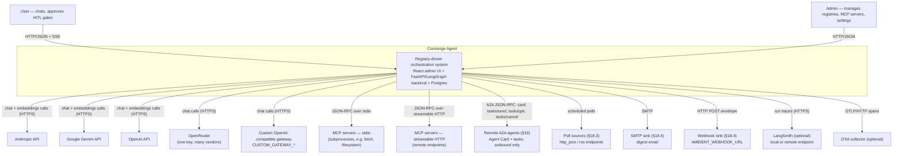
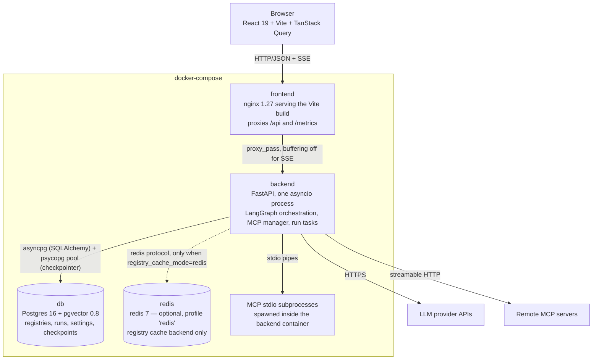
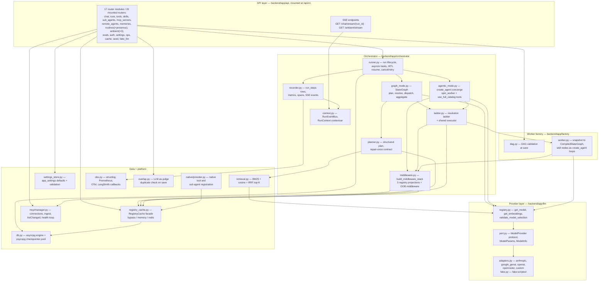
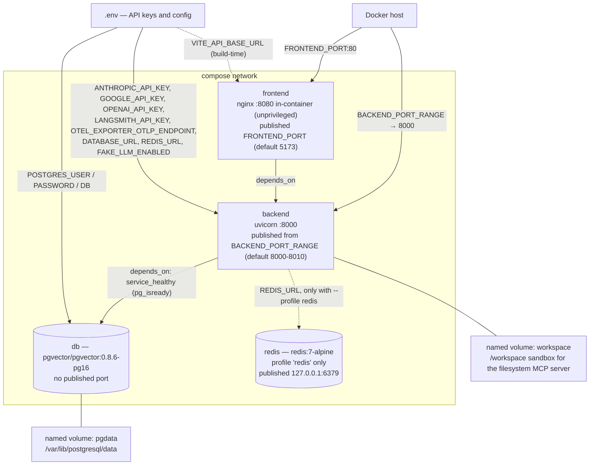
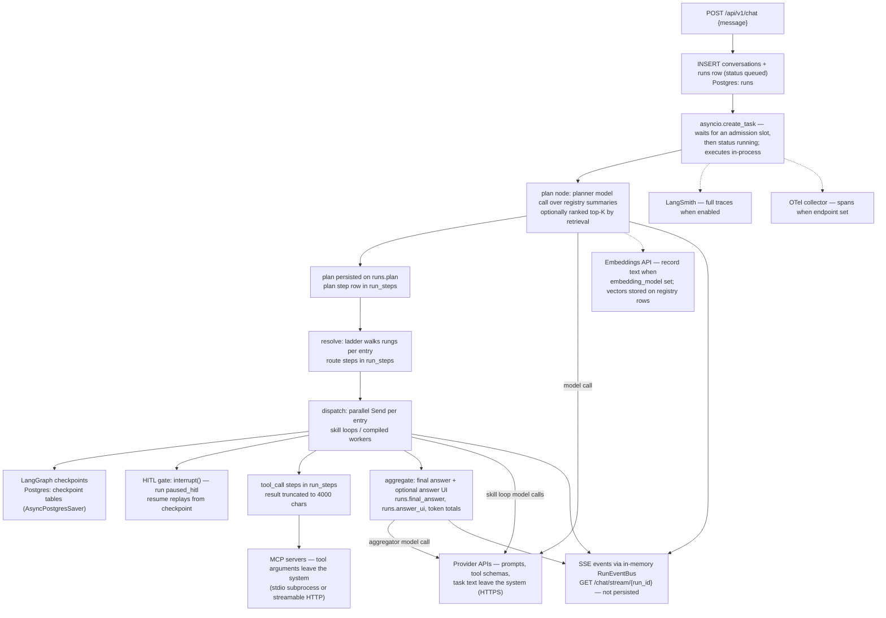

# Architecture Overview

This document is the entry point to the Concierge Agent architecture. It describes the system as built — every claim below is grounded in the source under `backend/app/`, `frontend/src/`, and `docker-compose.yml`. `spec.md` at the repo root is the specification the code implements; where the two drift, this document describes the code and flags the difference.

## The system in 10 minutes

Concierge Agent is a proof of concept for **registry-driven agentic orchestration**: a chat frontend, a single-process FastAPI + LangGraph backend, and a Postgres database that holds three capability registries. A user types a request; an orchestrator plans against the live registries, resolves each plan entry to the cheapest capability that can serve it, executes — possibly in parallel, possibly pausing for human approval — and streams a fully labeled trace back over SSE.

The core idea is the **tri-layer registry model**:

- **Tools** (`backend/app/models/tool.py`) are atomic callables. They come from two sources: MCP servers plugged in at runtime (`kind='mcp'`, ingested by `backend/app/mcp/manager.py` from `tools/list`) and code-defined native functions (`kind='native'`, registered at startup by `backend/app/native/provider.py`).
- **Skills** (`backend/app/models/skill.py`) are markdown documents — YAML frontmatter (name, persona, bound tools, `direct_exposure`) plus a multi-step instruction body, parsed by `backend/app/skilldoc.py`. Native skills ship as `.skill.md` files under `backend/app/native/skills/`; custom skills are authored in the admin UI in the same format. A skill executes as a LangChain `create_agent` tool loop that sees *only* its bound tools — isolation is enforced structurally by the middleware stack, not by prompt.
- **Sub agents** (`backend/app/models/sub_agent.py`) compose skills into workflows. Custom sub agents carry a JSON DAG (branching, parallel fan-out/join, error edges, human-in-the-loop gates) validated at save time by `backend/app/factory/dag.py` and compiled into a LangGraph `StateGraph` by the worker factory in `backend/app/factory/worker.py`. Native sub agents are code-built subgraphs registered with `covers_skill_ids`.

Every registry row is either `static` (seeded, definition immutable — only `status` and `direct_exposure` can be toggled) or `dynamic` (created at runtime through the API/UI). Registry state is projected into running agents *live*: three custom registry middlewares (`backend/app/orchestrator/middleware.py`) re-read the registries at each model call, so an MCP tool plugged in mid-conversation is callable on the next loop iteration without a restart.

A chat run is orchestrated in one of **two modes**, chosen by the live `orchestrator_mode` setting (`graph` | `agentic` — `settings_store.py` rejects anything else) and read afresh when each run row is created, so a Settings toggle takes effect on the next message with no deploy:

- **Graph mode** (`backend/app/orchestrator/graph_mode.py`) is a hand-built `StateGraph`: `plan → resolve → dispatch (parallel, via Send) → aggregate`. The planner (`backend/app/orchestrator/planner.py`) emits structured output against compact registry summaries (progressive disclosure) with a validate → repair-once → fail contract. Each plan entry then walks the deterministic **resolution ladder** (`backend/app/orchestrator/ladder.py`): direct exposed tool / direct exposed skill → native sub agent covering the skill → custom sub agent using the skill → ephemeral dynamic worker composed on the fly.
- **Agentic mode** (`backend/app/orchestrator/agentic_mode.py`) is a single `create_agent` concierge loop. Planning is emergent via LangChain's `TodoListMiddleware`; capabilities are exactly the live registries projected by the three registry middlewares; a `spin_worker` tool covers ladder rung 4 and a `use_full_catalog` tool is the logged escalation that unlocks the entire registry mid-run.

Both modes share the same registries, the same executor (`execute_resolution` in `ladder.py`), the same run recorder, and the same label set — they are built to be A/B compared.

`Run.orchestrator_mode` has a **third** value the setting cannot produce: **`direct`** (spec §7.5). `POST /api/v1/sub-agents/{id}/invoke` passes `mode="direct"` straight to `create_run`, pinning one sub agent and skipping planning and routing entirely; the run keeps the full lifecycle (SSE, HITL, formatter, trace, metrics) and is labelled `mode='direct'` throughout. So: two *settable* orchestration strategies, three *recorded* run modes. See [state-machines.md](state-machines.md) for the statuses these runs move through.

Everything else is supporting machinery: a `ModelProvider` port so no provider SDK leaks past `backend/app/llm/`, a registry cache facade with three live-switchable backends (`memory` by default), an in-memory SSE event bus, a Postgres checkpointer for HITL pause/resume, and always-on run tracing (Postgres rows + structlog + Prometheus + optional OTel and LangSmith).

## System context (C4 level 1)

Actors and external systems, as wired in the code. Provider adapters live in `backend/app/llm/adapters.py`; MCP client transports in `backend/app/mcp/manager.py`; observability exporters in `backend/app/obs.py`.

Everything on the right-hand side except the two observability sinks and the four provider APIs is reached **only** through `app/egress.py` (`EGRESS_POLICY`, M52): A2A cards and calls, poll sources, HTTP MCP servers and the webhook channel are all fetched on someone else's say-so, so each URL is judged by literal address and by resolution, every redirect hop is re-checked, and bodies stream under `EGRESS_MAX_BYTES`. Outbound A2A is **outbound only** — nothing calls in.

Provider API keys enter only as environment variables — `ANTHROPIC_API_KEY`, `GOOGLE_API_KEY`, `OPENAI_API_KEY`, **`OPENROUTER_API_KEY`**, and the custom gateway's **`CUSTOM_GATEWAY_BASE_URL` / `_API_KEY` / `_MODELS`** — read by `backend/app/config.py` and never stored in the database or exposed through the UI. (The other secrets on the same rule: `LANGSMITH_API_KEY`, `SMTP_PASSWORD`, `AMBIENT_WEBHOOK_URL`, `REDIS_URL`, `DATABASE_URL` — see [../security.md](../security.md).) A key's presence is what enables its provider in the Settings model selects (`is_configured()` per adapter). A scriptable fake provider (`backend/app/llm/fake.py`, `fake:scripted`, gated by `FAKE_LLM_ENABLED`) makes the whole stack runnable with no keys at all.

## Containers (C4 level 2)

`docker-compose.yml` defines four services; `redis` sits behind a compose profile and does not run by default.

Container notes, from the code:

- **frontend** — a multi-stage Dockerfile (`frontend/Dockerfile`) builds the Vite app and serves it with nginx. `frontend/nginx.conf` proxies `/api/` to `backend:8000` with `proxy_buffering off` and a one-hour read timeout so SSE streams survive, and proxies `/metrics` for Prometheus scrapes. The UI is **eleven** pages (`frontend/src/pages/`): Chat, MCP Servers, Remote Agents, Tools, Skills, Sub Agents, Runs, Evals, Memory, Ambient, Settings — Remote Agents and Ambient appear in the nav only while `a2a_enabled` / `ambient_enabled` are on. Since M54 nginx resolves `backend` per request through Docker's DNS, so replicas join and leave under `--scale` without a restart; since the hardening wave its listener is on **8080**, not 80, so the container runs unprivileged (the published host port is unchanged).
- **backend** — one FastAPI process (`backend/app/main.py`). Runs are `asyncio.Task`s in the same process (`start_run_task` in `backend/app/orchestrator/runner.py`); there is no broker, queue, or worker pool. Startup lifecycle (`lifespan` in `main.py`): Alembic `upgrade head` → seed load → stored `log_level`/`otlp_endpoint` overrides — all four inside the boot advisory lock, so N replicas do them once — then connection-budget check → checkpointer table setup → `reap_orphaned_runs` (anything this replica left `running`/`queued` last time is failed, since it cannot resume) → registry cache warm-up → MCP manager connect-then-rebind (non-blocking) → A2A manager (non-blocking) → embedding backfill (non-blocking) → the periodic memory/retention/pricing loop.
- **db** — the only mandatory stateful service. The image is **`pgvector/pgvector:0.8.6-pg16`**, not stock `postgres:16`: migration `a1b2c3d4e5f6` runs `CREATE EXTENSION IF NOT EXISTS vector` (and `btree_gist`) for the §16.1 memory-recall vectors. The registry retrieval vectors are unaffected — they remain plain JSONB columns scored in-process ([ADR-0006](../adr/0006-jsonb-embeddings-before-pgvector.md)). The backend opens two connection paths: an async SQLAlchemy engine over `asyncpg` (`backend/app/db.py:get_engine`) for application tables, and a `psycopg` `AsyncConnectionPool` for LangGraph's `AsyncPostgresSaver` checkpointer (`backend/app/db.py:get_checkpointer`), which creates its own checkpoint tables.
- **redis** — exists solely as an alternative backend for the registry cache (`backend/app/registry_cache.py`); enabled with `docker compose --profile redis up` plus `REDIS_URL`. Execution never depends on Redis.
- **MCP stdio subprocesses** are not compose services: `backend/app/mcp/manager.py` spawns them (`mcp.client.stdio.stdio_client`) inside the backend container, one long-lived asyncio task holding each client session open.

## Backend components (C4 level 3)

Component responsibilities, grounded in source:

- **API routers** (`backend/app/api/__init__.py`) — REST/JSON under `/api/v1`: registry CRUD with static-record write rejection, MCP server lifecycle, chat + SSE, run control (cancel/retry/HITL), settings, cache mode/refresh, seed, and the `/_fake/script` control endpoint (mounted only when `FAKE_LLM_ENABLED` is set). `/health` and `/metrics` are on the app root.
- **Runner** (`orchestrator/runner.py`) — creates `runs` rows, launches each run as an `asyncio.Task` tracked in `RUNNING_TASKS`, dispatches to the mode implementations, finalizes status/tokens/answer, and handles HITL resume by replaying from the Postgres checkpoint (`Command(resume=...)`, targeting individual interrupts by id when parallel gates are pending). Cancellation is cooperative task cancellation.
- **Resolution ladder** (`orchestrator/ladder.py`) — `resolve_capability` walks the rungs deterministically over the registry cache: `direct_tool` / `direct_skill` → `native_sub_agent` (via `covers_skill_ids`) → `custom_sub_agent` (first custom agent using the skill) → `dynamic_worker` (ephemeral snapshot over **exposed** registry skills, gated by `dynamic_worker_fallback_enabled`, named `worker-alpha (skills...)` per run). `execute_resolution` is the single executor behind graph-mode dispatch and the agentic middlewares' handlers, including worker invocation with `interrupt()` propagation for HITL.
- **Worker factory** (`factory/worker.py`, `factory/dag.py`) — validates workflow DAGs at save (single START edge, acyclicity, reachable END, active skill refs, at most one error edge per node) and compiles snapshots into `CompiledStateGraph`s: explicit routing/fan-out/join mechanics at the shell, `create_agent` skill loops at the leaves, joins as LangGraph deferred nodes, `node_outputs` as an order-insensitive keyed merge.
- **Middleware stack builder** (`orchestrator/middleware.py`) — `build_middleware_stack(context)` is the only composition path. `SkillLoopContext` → Summarization + call limit + scoped `ToolsRegistryMiddleware` (bound tool ids only). `FallbackLoopContext` → full-catalog Tools + Skills projections. `AgenticLoopContext` → TodoList + Summarization + call limit + all three registry middlewares, exposure-gated, with a live `full_catalog` flag escalation. The three registry middlewares are stateless projections that re-resolve live tool/skill/sub-agent objects from the cache at every model call.
- **Provider port** (`llm/`) — `ModelProvider` is a `Protocol` (`port.py`); adapters self-register via the `@model_provider` decorator (`registry.py`); `get_model("provider:model")` and `get_embeddings(...)` are the only entry points. Adapters map the normalized `effort` param onto Anthropic thinking budgets (adaptive thinking for the Claude 5 family), Gemini thinking budgets, and OpenAI reasoning effort — OpenAI reasoning runs are routed through the Responses API (`use_responses_api=True` in `adapters.py`) because chat completions rejects function tools combined with `reasoning_effort`.
- **Registry cache** (`registry_cache.py`) — singleton facade over every registry/settings read in the run path. Backend chosen live by the `registry_cache_mode` setting: `memory` (**the shipped default**: per-process, generation counters, reload-on-dirty), `bypass` (straight DB queries on every read — the rollback lever, a live read rather than a faster cache), `redis` (same contract over Redis blobs, requires `REDIS_URL`). **Invalidation is the freshness mechanism**: every write path calls `invalidate(registry)` before returning, which is what keeps visibility at "next model call". A TTL exists but is not that mechanism — `REGISTRY_CACHE_TTL_S` (default 300 s) expires every memory-mode entry and every redis blob so that the one case invalidation cannot cover, a **cross-replica NOTIFY that was never delivered**, costs at most one TTL of staleness instead of unbounded staleness. Cross-replica invalidation rides Postgres `LISTEN/NOTIFY` on channel `registry_cache_inv` — dormant in the single-node deployment. See [components.md](components.md) and [ADR-0004](../adr/0004-registry-cache-bypass-default.md).
- **Retrieval** (`retrieval.py`) — progressive-disclosure ranking, off by default (`retrieval_enabled=False`). Above `retrieval_threshold` records, catalogs are ranked to `retrieval_top_k` by Okapi BM25 over name/description plus cosine over stored embeddings (fetched through the embeddings port), fused with reciprocal-rank fusion. Entities already used in a run are pinned past ranking; skill loops and workers are never ranked — they stay id-pinned contracts.
- **MCP manager** (`mcp/manager.py`) — one asyncio task per active server holds the client session open (stdio via `stdio_client`, HTTP via `streamablehttp_client`); `tools/list` results upsert into the tools registry; `listChanged` notifications trigger reconciliation; a ping loop (interval from live settings) flips failing servers to `error`. The DB is the source of truth: startup reconnects every non-deleted server.
- **Settings store** (`settings_store.py`) — `app_settings` key/value rows with typed defaults (orchestrator mode, model refs and params, parallelism and iteration limits, cache mode, retrieval knobs, observability switches). Reads are live; a PATCH applies to the next run.
- **Run event bus + SSE** (`orchestrator/context.py`, `api/chat.py`) — `RunEventBus` is an in-memory per-run fan-out with history replay: `recorder.emit()` appends to history and pushes to subscriber queues; `GET /chat/stream/{run_id}` serves it via `sse-starlette`. Events are not persisted to a table — the durable trace is `run_steps` (see the data-flow section).
- **Observability** (`obs.py`, `orchestrator/recorder.py`) — every step start/finish writes a `run_steps` row, a structlog JSON event, Prometheus counters/histograms, an OTel span, and matching SSE events, all carrying the shared label set `{run_id, step_id, tier, kind, source, entity_id, entity_name, model, effort, tokens, duration_ms, status}`. LangSmith callbacks are built per run from live settings.

## Deployment

Topology from `docker-compose.yml` and `.env.example`:

- **Ports.** `frontend` publishes `${FRONTEND_PORT:-5173}:8080` (its nginx listens on 8080 so the container can run unprivileged); `backend` publishes the **range** `${BACKEND_PORT_RANGE:-8000-8010}:8000`, one host port per replica under `--scale backend=N`; `db` publishes nothing; `redis` (profile only) binds `127.0.0.1:6379:6379`. `BACKEND_PORT` is *not* the published port — it is the port the backend is reached on outside compose (the fast dev loop's `uvicorn --port`, `VITE_API_BASE_URL`); the lifecycle scripts ask `docker compose port backend 8000` instead of assuming the two agree.
- **Volumes.** `pgdata` persists Postgres; `workspace` is mounted at `/workspace` in the backend as the sandbox root for the seeded filesystem MCP server (`WORKSPACE_DIR`).
- **Env var flow for keys.** Provider, LangSmith, and Redis credentials travel exclusively `.env → compose environment → backend process env → app/config.py`. They are never written to Postgres, never returned by the API, never rendered in the UI. Key presence toggles provider availability at runtime.
- **Redis profile.** The default stack is three services. `docker compose --profile redis up` plus `REDIS_URL=redis://redis:6379/0` adds the optional cache backend; actually using it remains a Settings decision (`registry_cache_mode=redis`).
- **First boot.** The backend lifespan runs Alembic migrations and loads seeds (two stdio MCP servers — fetch and filesystem — one native tool, two native skills, the `research-concierge` sub agent), so a fresh `docker compose up` is fully self-provisioning.

## Data flow: one prompt, end to end

What happens to a single chat message in graph mode, what is persisted where, and what leaves the system:

Persistence inventory:

| Data | Where | Written by |
|---|---|---|
| Conversations, runs (status, plan, final answer, answer UI, token totals) | `conversations`, `runs` tables | `orchestrator/runner.py`, `graph_mode.py` |
| Step-level trace (plan/route/skill/hitl/tool_call/aggregate, parent links, tokens, errors) | `run_steps` table | `orchestrator/recorder.py` |
| Graph execution state for HITL pause/resume and worker replay | LangGraph checkpoint tables, created by `AsyncPostgresSaver.setup()` | `db.py` checkpointer, keyed by `thread_id = run_id` (workers: `run_id:entry_id`) |
| Registry definitions and settings | `tools`, `skills`, `sub_agents`, `mcp_servers`, `app_settings` | API routers, MCP ingest, native scan, seed loader |
| Embedding vectors + content hashes | `embedding` / `embedding_hash` JSON columns on the three registry tables (plain columns, not pgvector) | `retrieval.py` backfill via the embeddings port |
| Live SSE event stream | in-memory `RunEventBus` only — replayable while the process lives, gone on restart; `run_steps` is the durable record | `orchestrator/context.py` |

What leaves the system: model prompts (including registry summaries, skill instructions, and task text) to whichever provider each model ref names; tool arguments and results to/from MCP servers; traces to LangSmith and spans to an OTLP endpoint only when those switches are on. Nothing else calls out.

## Key design decisions

Each decision has a full ADR; one-paragraph summaries here.

- **[ADR 0001 — No broker, single process](../adr/0001-no-broker-single-process.md).** Runs are `asyncio.Task`s inside the one FastAPI process; Postgres is the only mandatory stateful service. HITL pause/resume rides the LangGraph checkpointer rather than a queue, and cancellation is cooperative task cancellation — eliminating Celery/Redis/broker operational surface at POC scale.
- **[ADR 0002 — ModelProvider port](../adr/0002-model-provider-port.md).** All model access goes through `get_model("provider:model")` against a decorator-populated adapter registry in `backend/app/llm/`; no provider SDK import exists outside that package, including for Anthropic. A custom gateway adapter drops in with zero consumer changes, and every adapter passes a shared contract test suite.
- **[ADR 0003 — Middleware precedence](../adr/0003-middleware-precedence.md).** Out-of-box LangChain middleware first (TodoList, Summarization, ModelCallLimit), composition hooks second, custom middleware only where nothing OOB fits — which is exactly the three registry projections. `build_middleware_stack(context)` is the single sanctioned composition path, and skill-loop isolation (bound tools only) is enforced by stack construction, not convention.
- **[ADR 0004 — Registry cache facade](../adr/0004-registry-cache-bypass-default.md)** *(Accepted, default amended)*. Every run-path registry read goes through one `RegistryCache` facade whose backend flips live between `bypass`, `memory`, and `redis`, with event invalidation keeping visibility at "next model call". The record was written with `bypass` as the shipped default; the amendment flips that to **`memory`** — since every write invalidates before returning, a cached read is never staler than a bypassed one, so `bypass` was paying a Postgres round-trip per read for a guarantee the cache already gave. `bypass` remains a valid, live-flippable mode and the rollback lever. The ADR's original "TTLs are forbidden" line is corrected there too: `REGISTRY_CACHE_TTL_S` (300 s) exists as a backstop bounding a lost cross-replica NOTIFY, not as the freshness mechanism.
- **[ADR 0005 — Hybrid retrieval, BM25 + RRF](../adr/0005-hybrid-retrieval-bm25-rrf.md).** Catalog ranking runs in-process over the cache snapshot: dependency-free Okapi BM25 plus optional embedding cosine, fused by reciprocal-rank fusion. No per-call DB query, graceful degradation to lexical-only when no embedding model is configured, and pinned ids so in-flight entities never vanish from a ranked catalog.
- **[ADR 0006 — JSONB embeddings before pgvector](../adr/0006-jsonb-embeddings-before-pgvector.md).** Vectors are stored as plain JSON columns (`embedding`, `embedding_hash`) on the registry tables and scored in Python. At hundreds of records, an ANN index buys nothing; deferring pgvector keeps the schema portable and the Postgres image stock until scale demands otherwise.
- **[ADR 0007 — OpenAI Responses API routing](../adr/0007-openai-responses-api-routing.md).** OpenAI reasoning models reject function tools combined with `reasoning_effort` on chat completions, so the OpenAI adapter routes any effort-bearing run through the Responses API (`use_responses_api=True`, `output_version="responses/v1"`) while returning the same `BaseChatModel` — the quirk is contained entirely inside the adapter.
- **[ADR 0008 — LISTEN/NOTIFY for cross-replica invalidation](../adr/0008-listen-notify-cross-replica.md).** Cache invalidations broadcast over Postgres `pg_notify` on the `registry_cache_inv` channel with an origin id to skip self-notifications. Dormant and harmless on a single node, it makes the memory/redis cache modes multi-replica-safe without adding a message bus.
- **[ADR 0009 — Skills as markdown](../adr/0009-skills-as-markdown.md).** One document format — YAML frontmatter plus markdown instructions — serves both native `.skill.md` files scanned at startup and UI-authored custom skills, parsed by `backend/app/skilldoc.py`. Skills stay human-reviewable, diffable prompts with declared tool bindings rather than opaque config.
- **[ADR 0010 — Two orchestrator modes](../adr/0010-two-orchestrator-modes.md)** *(Accepted, addendum)*. The deterministic graph pipeline and the emergent agentic loop share the registries, ladder executor, recorder, and label set, and switch via one setting — a live A/B harness for the central open question of how much orchestration to hand the model. The setting is still binary (`graph` | `agentic`); the addendum records the later `direct` run mode, which bypasses planning and routing entirely rather than adding a third orchestrator.

## Related documents

- [Data model](./data-model.md) — tables, relationships, migration strategy
- [Components](./components.md) — per-component deep dives
- [Runtime flows](./runtime-flows.md) — sequence diagrams for chat, MCP plug-in, HITL
- [State machines](./state-machines.md) — run and MCP server lifecycles
- [Resolution ladder](./resolution-ladder.md) — rung-by-rung semantics and fallbacks
