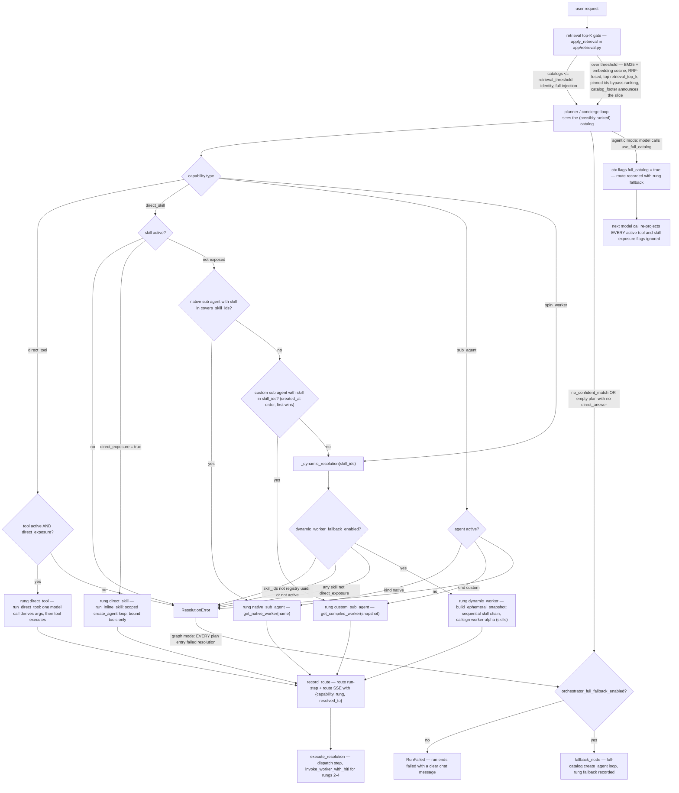

# Capability Resolution Ladder

The ladder is the deterministic, pure-code mapping from a planned capability to something executable. It lives in `backend/app/orchestrator/ladder.py` (`resolve_capability` → `Resolution` → `execute_resolution`) and reads only through the registry cache (`backend/app/registry_cache.py`). The same executor backs graph-mode dispatch (`dispatch_node` in `backend/app/orchestrator/graph_mode.py`) and the agentic middlewares' tool handlers (`backend/app/orchestrator/middleware.py`).

The `Resolution.rung` values recorded in code: `direct_tool`, `direct_skill`, `native_sub_agent`, `custom_sub_agent`, `dynamic_worker` — plus `fallback` recorded when the full catalog is engaged.

## The rungs, as implemented

**Input contract.** `resolve_capability(capability)` receives a plan-entry capability dict `{type, id?, skill_ids?}` where `type` is one of the planner's literals `direct_tool | direct_skill | sub_agent | spin_worker` (`PlanCapability` in `backend/app/orchestrator/planner.py`). Unknown types raise `ResolutionError`.

**Rung 1a — `direct_tool`.** `cache.tool_by_id` must return an `active` tool with `direct_exposure=True`; either miss raises `ResolutionError`. Execution is `run_direct_tool`: the tool is materialized via `resolve_tools_by_ids`, bound to the default model (`resolve_node_model({}, {})`), and the `direct_tool` prompt (`backend/app/prompts/`) drives a single model call to derive arguments before `tool.ainvoke(call["args"])` executes. Recorded as a `tool_call` step at tier `tool`.

**Rung 1b — `direct_skill`.** An active skill with `direct_exposure=True` resolves immediately to rung `direct_skill`. Execution is `run_inline_skill`: a `create_agent` loop assembled with `build_middleware_stack(SkillLoopContext(...))` — `SummarizationMiddleware`, `ModelCallLimitMiddleware` (`max_tool_iterations + 1`), and `ToolsRegistryMiddleware` in `scoped` mode over the skill's bound tool ids only. Isolation is structural: a skill loop never receives the Skills or SubAgents registry middlewares (spec §3.3).

**Rung 2 — `native_sub_agent`.** For a non-exposed skill, the first `active` sub agent with `kind == "native"` whose `covers_skill_ids` contains the skill wins. Execution goes through `get_native_worker(name, checkpointer)` (`backend/app/factory/worker.py`), which bypasses the worker factory and calls the registered build callable directly.

**Rung 3 — `custom_sub_agent`.** Failing rung 2, the first `active` custom sub agent (in `created_at` order — `cache.sub_agents()` guarantees this ordering, and rung-3 precedence relies on it) whose `skill_ids` include the skill wins. Its `cache.sub_agent_snapshot` — persona, workflow DAG, embedded skill snapshots — feeds `get_compiled_worker`, which compiles the DAG via `build_worker` and caches the compiled graph keyed by `(sub_agent_id, updated_at, checkpointer)`.

**Rung 4 — `dynamic_worker` (spin_worker).** Reached by naming skills: an explicit `{type: "spin_worker", skill_ids}` capability (the planner in graph mode, or the literal `spin_worker` tool in agentic mode). `_dynamic_resolution` first checks the `dynamic_worker_fallback_enabled` setting, then enforces a strict id contract: every `skill_id` must parse as a UUID and resolve to an active skill — non-UUID input gets a guidance-bearing `ResolutionError` ("Pass skill ids exactly as shown in the Available skills catalog; … unlock the full registry first with use_full_catalog") instead of crashing the run.

**Exposed skills only.** Every composed skill must also carry `direct_exposure=true`. A hidden skill has exactly two sanctioned routes — a sub agent that owns it (rungs 2–3), or the full-catalog fallback, which runs it inline, in the open, with its own `route` step and chat banner — so it is never wrapped in an ephemeral worker the user was never shown. The rule holds whatever the caller and however it learned the id: a run that engaged `use_full_catalog` sees hidden skills but still cannot compose them, because `RunFlags.full_catalog` is a read surface, not a grant. The consequence for the older `direct_skill` path is that a non-exposed skill nobody covers now stops with that guidance instead of falling through to a worker. Enforcement is announced as well as enforced: `prompts/planner.md` states the constraint, plan validation rejects such an entry as a repairable error, and the agentic skills catalog prints a non-exposed skill as `(fallback only — call it directly; it cannot be composed into an ephemeral worker)`, withholding the registry id `spin_worker` would need to quote. The worker itself is `build_ephemeral_snapshot`: the skills chained sequentially as a one-off DAG, first skill's persona leading, never cached. The entity name is `worker-<callsign> (<skill>+<skill>)` — callsigns (`worker-alpha`, `worker-bravo`, …) are sequential per run (`RunContext.next_worker_callsign`, `backend/app/orchestrator/context.py`) so parallel ephemeral workers stay distinguishable in rails, ticker, and trace.

**Full-catalog fallback (not a resolution rung).** Graph mode diverts to `fallback_node` when the planner signals `no_confident_match` (or returns no entries and no `direct_answer`), or when `resolve_node` fails **every** plan entry — gated by `orchestrator_full_fallback_enabled`; when disabled, the run raises `RunFailed` with a clear chat message ("no capability confidently matches this request and the full-catalog fallback is disabled"). The fallback is a `create_agent` loop with `FallbackLoopContext`: `ToolsRegistryMiddleware(mode="full_catalog")` + `SkillsRegistryMiddleware(mode="full_catalog")` — every active tool and skill, exposure flags ignored, while dispatched skill handlers stay isolated. Agentic mode escalates instead via the `use_full_catalog` tool, which flips `ctx.flags.full_catalog` so the exposed-mode middlewares re-project the full registry on the next model call. Both paths record a route with rung `fallback`, and the chat renders the amber "full-catalog fallback engaged" banner (`RouteCard` in `frontend/src/pages/ChatPage.tsx`).

## Where the retrieval top-K gate sits

The gate (`apply_retrieval`, `backend/app/retrieval.py`) sits **upstream of the ladder** — it shapes the catalog the planner and the agentic loop can *see*, never what the ladder can *resolve*. Consumers: `registry_summaries` for the graph-mode planner and the three registry middlewares' per-model-call projections. Mechanics:

- Activates only when `retrieval_enabled` and the catalog exceeds `retrieval_threshold` records; below that it is the identity function.
- Ranking is reciprocal-rank fusion (`rrf_fuse`) of BM25 over name + description (`bm25_scores`) and cosine over stored embeddings when an `embedding_model` is configured; the top `retrieval_top_k` survive.
- **Pins bypass ranking**: every entity used in the run is added to `ctx.pinned_ids` by `RunRecorder.start_step`, and pinned records are appended even when ranked out — capabilities already in play never vanish mid-run.
- Every truncated catalog appends the `catalog_footer` honesty line — "showing N of M … call `use_full_catalog` to widen if something you need seems missing" — so the model knows it sees a slice; the planner gets the same notes in its prompt (`build_planner_prompt`).
- Scoped skill loops are pinned contracts and full-catalog mode is the deliberate escape hatch: neither is ever ranked.

The ladder itself resolves ids against the **full** cache (`tool_by_id`, `skill_by_id`, `sub_agent_by_id`), so a plan referencing a ranked-out-but-valid id still resolves.

## What happens on no-confident-match

The planner's structured output (`PlannerOutput`) carries an explicit `no_confident_match: bool`. When set — or when the plan is empty with no `direct_answer` — `plan_node` routes to fallback if enabled, else fails the run. In agentic mode there is no planner signal; the equivalent is the model deciding the exposed selection cannot cover the request and calling `use_full_catalog`, whose docstring frames it as exactly that escalation. A `spin_worker` call with unusable skill ids does not kill the run either way: graph mode surfaces it as an entry-level error output for the aggregator, and the agentic tool returns "could not spin a worker: …" as the tool result so the loop can self-correct.

## How rungs land on the trace

Every resolution is logged by `RunRecorder.record_route` (`backend/app/orchestrator/recorder.py`): a `route` run-step at tier `orchestrator` whose input is the capability dict and whose output is `{rung, resolved_to: {rung, entity_id, entity_name, tier, kind}}` (from `Resolution.as_route()`), plus a matching `route` SSE event. Callers: `resolve_node` per plan entry (graph mode), `SubAgentsRegistryMiddleware`/`SkillsRegistryMiddleware` handlers and the `spin_worker` / `use_full_catalog` tools (agentic mode) — HITL resume replays skip re-recording when `find_running_dispatch` shows the dispatch step already exists. Execution then records a dispatch step (`execute_resolution` with `emit_dispatch=True` → `dispatch_start`/`dispatch_end` SSE), under which worker node outputs, tool calls, and HITL gates nest via `parent_step_id`. The frozen `Resolution` dicts (minus rebuild-safe payload handling) are also persisted onto `run.snapshot` at resolve time (spec §3.6), and `Resolution` objects are rebuilt from that checkpoint-safe state on HITL replay (`dispatch_node`).

---

**See also:** [runtime-flows.md](runtime-flows.md) · [state-machines.md](state-machines.md) · [overview.md](overview.md)
