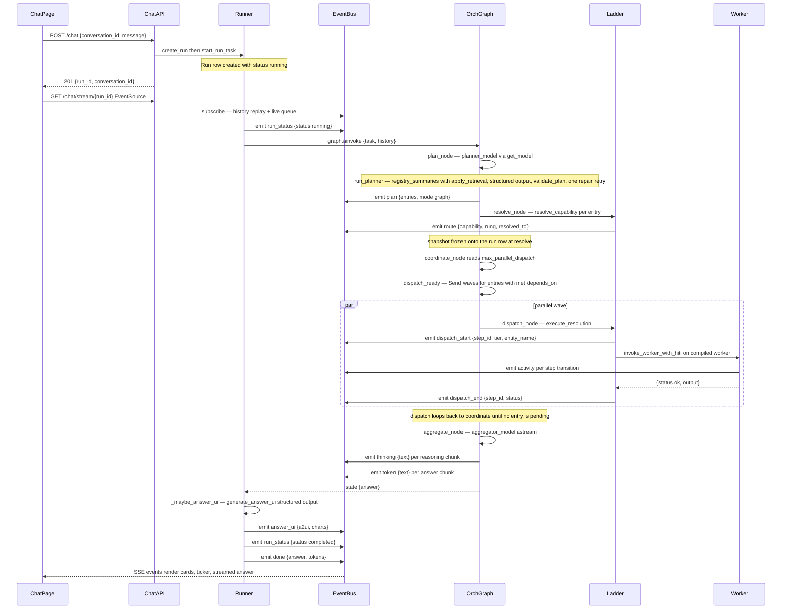
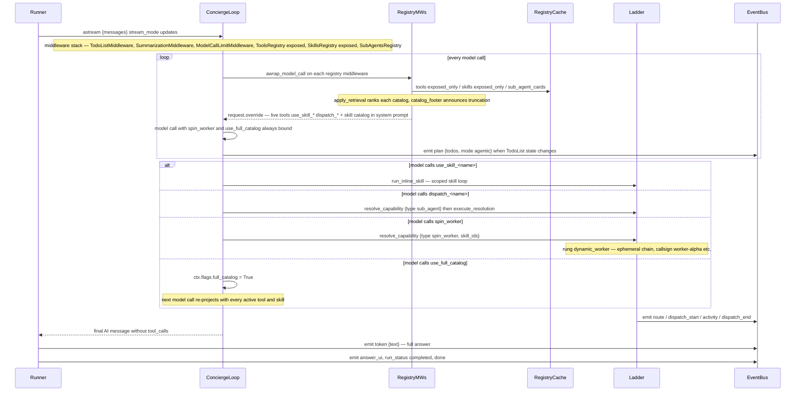
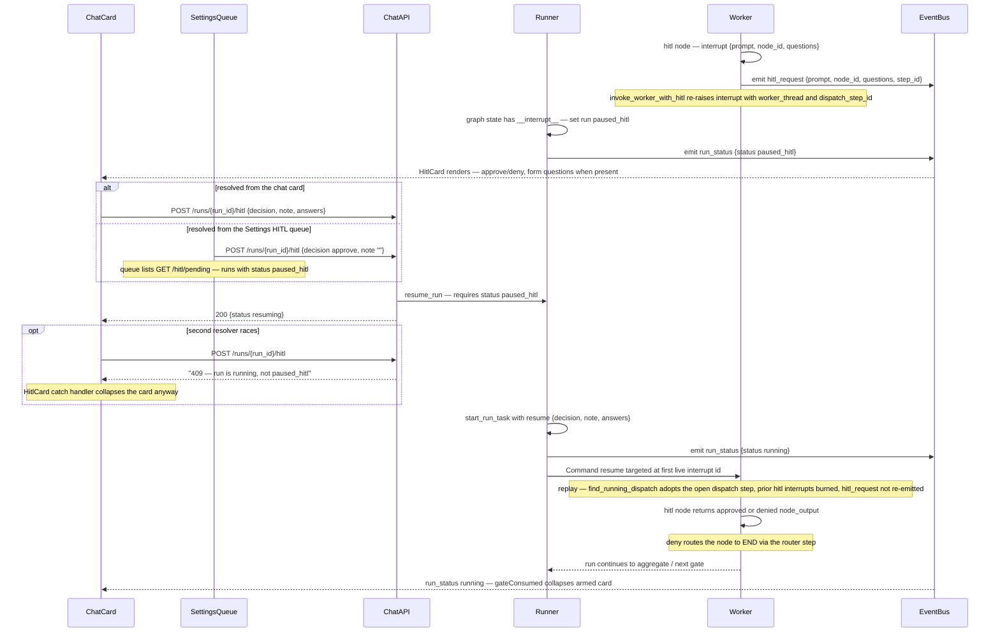
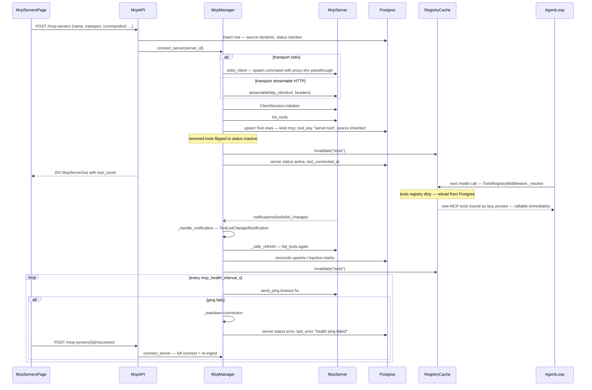
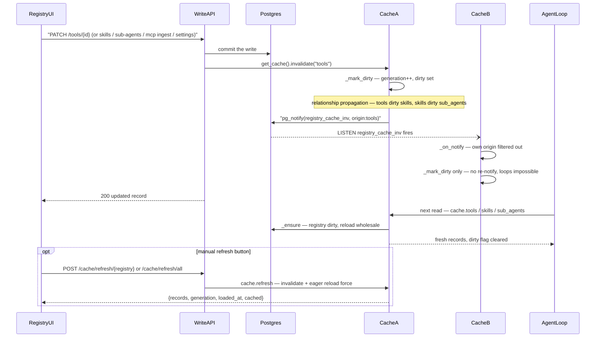

# Runtime Flows

Sequence diagrams for the five core runtime flows of the Concierge Agent POC. Every participant, endpoint, SSE event name, node name, and status in these diagrams is taken directly from the code cited in each walkthrough.

All HTTP paths below are mounted under the `/api/v1` prefix (`backend/app/main.py`).

The full SSE vocabulary, emitted by `RunRecorder.emit` (`backend/app/orchestrator/recorder.py`) and the runner (`backend/app/orchestrator/runner.py`), and subscribed to by name in `frontend/src/api/client.ts` (`streamRun`):

`run_status`, `plan`, `route`, `dispatch_start`, `dispatch_end`, `activity`, `token`, `thinking`, `answer_ui`, `hitl_request`, `error`, `done` — plus a `ping` keepalive that `chat_stream` (`backend/app/api/chat.py`) emits after 120 s of queue silence.

---

## 1. Graph-mode run, end to end

A graph-mode run is a hand-built LangGraph `StateGraph` with nodes `plan → resolve → coordinate → dispatch → aggregate` (plus `fallback`), compiled in `build_orchestrator_graph` (`backend/app/orchestrator/graph_mode.py`).

**Walkthrough.** `POST /chat` (`backend/app/api/chat.py`) calls `create_run` — which inserts a `Run` row with `status="running"` — and `start_run_task`, which spawns `_execute` as a plain asyncio task in the same FastAPI process (`backend/app/orchestrator/runner.py`; no broker, per spec §2). The response returns `run_id` immediately; the UI then opens `GET /chat/stream/{run_id}`, whose generator subscribes to the in-memory `EVENT_BUS` (`backend/app/orchestrator/context.py`) and yields history replay followed by live events.

`plan_node` resolves the planner model from settings (`planner_model` falling back to `default_model`) and calls `run_planner` (`backend/app/orchestrator/planner.py`): it assembles progressive-disclosure catalog summaries through `registry_summaries` (each catalog gated by `apply_retrieval`, see [resolution-ladder.md](resolution-ladder.md)), invokes the model with `with_structured_output(PlannerOutput)`, then `validate_plan` checks entry-id uniqueness, `depends_on` references, `max_plan_steps`, and that every referenced capability id resolves to an active registry record. On errors it retries exactly once with the error list appended to the prompt; a second failure raises `PlanFailure` → `RunFailed`, and the run finishes `failed` with the raw planner outputs stored on `run.plan`.

`resolve_node` runs the deterministic ladder (`resolve_capability`, `backend/app/orchestrator/ladder.py`) for every entry, logging each decision via `record_route` (a `route` run-step plus a `route` SSE event). If *every* entry fails resolution the run diverts to `fallback_node` (when `orchestrator_full_fallback_enabled`) — otherwise partial failures become error outputs for the aggregator. `coordinate_node` (a `defer=True` node) re-runs after each dispatch wave; `dispatch_ready` returns `Send("dispatch", ...)` packets for every entry whose `depends_on` outputs exist, capped at `max_parallel_dispatch` — this is the parallel wave mechanic. Each `dispatch_node` executes `execute_resolution`, which records a dispatch step (`emit_dispatch=True` → `dispatch_start`/`dispatch_end` events) and drives the compiled worker through `invoke_worker_with_hitl`.

`aggregate_node` streams the aggregator model: reasoning chunks surface as `thinking` events, answer chunks as `token` events. Back in `_execute`, `_maybe_answer_ui` calls `generate_answer_ui` (`backend/app/orchestrator/answer_ui.py`) — a structured-output pass that produces A2UI v0.9 messages plus optional chart specs, failure-safe by contract — then the runner persists `status="completed"` and emits `answer_ui`, `run_status {completed}`, and the terminal `done {answer, tokens}` event.

---

## 2. Agentic-mode run

Agentic mode replaces the hand-built graph with a single `create_agent` concierge loop (`build_agentic_agent`, `backend/app/orchestrator/agentic_mode.py`). Planning is emergent via `TodoListMiddleware`; capabilities are projected live by the three registry middlewares on **every model call**.

**Walkthrough.** `_run_agentic` (`backend/app/orchestrator/runner.py`) builds the agent with `build_middleware_stack(AgenticLoopContext(...))` (`backend/app/orchestrator/middleware.py`), which composes, in order: `TodoListMiddleware`, `SummarizationMiddleware`, `ModelCallLimitMiddleware` (limit `max(max_tool_iterations * 3, 12)`), then the three registry projections — `ToolsRegistryMiddleware(mode="exposed")`, `SkillsRegistryMiddleware(mode="exposed")`, `SubAgentsRegistryMiddleware()`.

The only statically bound tools are the two capability tools defined in `agentic_mode.py`: **`spin_worker`** (`skill_ids: list[str], task: str` — registry UUIDs only, bad ids return an error string so the loop self-corrects) and **`use_full_catalog`** (flips `ctx.flags.full_catalog`, recorded as a `route` step with rung `fallback`). Everything else is projected per model call in `awrap_model_call`: `ToolsRegistryMiddleware._resolve` materializes live tool objects from the cache (exposed-only, retrieval-gated); `SkillsRegistryMiddleware._refresh` builds a `use_skill_<sanitized-name>` tool per exposed skill and injects an "Available skills" catalog — with registry ids, since `spin_worker`'s contract is ids-only — into the system prompt; `SubAgentsRegistryMiddleware._refresh` builds a `dispatch_<sanitized-name>` tool per sub-agent card whose handler is the resolution-ladder executor. Because the projection re-runs every model call, a registry write made mid-run is visible on the very next iteration, and `use_full_catalog` widens the projection live.

The runner consumes `agent.astream(..., stream_mode="updates")`, extracting the `todos` state each update and emitting `plan {todos, mode: "agentic"}` whenever the list changes — that is the live todo checklist the chat renders. The final answer is the last AI message without tool calls (`final_answer_from_messages`); the runner records it as an `aggregate` step for label comparability and emits it as a single `token` event, then follows the same `answer_ui` → `run_status {completed}` → `done` tail as graph mode.

---

## 3. HITL pause and resume

HITL gates are `hitl` nodes in worker DAGs (`_make_hitl_node`, `backend/app/factory/worker.py`) that call LangGraph `interrupt()`. The pause propagates worker → dispatch handler → orchestrator thread, and resume rides the Postgres checkpointer.

**Walkthrough.** When a worker hits an `hitl` node, `interrupt(payload)` fires with `{prompt, node_id}` plus `questions` for form gates (validated at save time by `validate_workflow`, `backend/app/factory/dag.py`: kinds `approve|choice|text`, unique ids, choice needs ≥ 2 options). `invoke_worker_with_hitl` (`backend/app/orchestrator/ladder.py`) catches the worker's interrupt, emits the **`hitl_request`** SSE event — payload `{prompt, node_id, questions, step_id}` where `step_id` is the owning dispatch step so the chat can nest the card under its sub-agent rail — and re-raises `interrupt()` on the orchestrator thread, adding `worker_thread` and `dispatch_step_id` so the runner can tell live gates from stale ones when parallel dispatches interrupt at once. `_execute` sees `__interrupt__` in the returned state, sets the run to **`paused_hitl`**, and emits `run_status {paused_hitl}`.

Both resolution surfaces POST the **same endpoint**: the chat `HitlCard` (`frontend/src/pages/ChatPage.tsx`) sends `{decision, note, answers?}`, and the Settings HITL queue (`frontend/src/pages/SettingsPage.tsx`, backed by `GET /hitl/pending` in `backend/app/api/settings.py`) sends `{decision, note: ""}`. `resolve_hitl` (`backend/app/api/chat.py`) calls `resume_run`, which raises `ValueError` unless `run.status == "paused_hitl"` — surfaced as **HTTP 409** ("run is running, not paused_hitl") to any second resolver. The card's catch handler treats 409 as "resolved elsewhere" and collapses rather than staying armed-but-dead.

Resume is a fresh `start_run_task(run_id, resume={...})`: the runner flips status back to `running`, and `_resume_command` inspects pending interrupts on the checkpoint thread — when several gates are pending it targets the first **live** one by interrupt id (`Command(resume={target.id: resume})`), so the run pauses again for the remaining gates instead of erroring. On the worker thread, replay is idempotent: `find_running_dispatch` adopts the existing dispatch step instead of recording a duplicate, previously answered `hitl` interrupts are "burned" so the pending one lines up with the delivered resume value, and the pre-pause `hitl_request` is not re-emitted. Approve continues (answers ride into worker state as `node_outputs[node_id].answers`); deny records `{status: "denied", note}` and the router step routes the node to `END`. If the resumed run pauses again, `_emit_pending_hitl` re-announces the still-waiting gates.

On the frontend, `LiveRun` computes `gateConsumed`: any `run_status` event **after** the newest `hitl_request` whose status is not `paused_hitl` marks the gate as consumed — whether via this card, the Settings queue, a cancel, or a resume replay — so armed buttons are never left on a gate the backend already closed. See [state-machines.md](state-machines.md) for the full gate lifecycle.

---

## 4. MCP server plug-in

The MCP connection manager (`McpManager`, `backend/app/mcp/manager.py`) owns one client session per active `mcp_server` record, each held open by its own asyncio task.

**Walkthrough.** `POST /mcp-servers` (`backend/app/api/mcp_servers.py`) inserts the row with `source="dynamic"` and `status="inactive"` — registered but not yet connected — then calls `manager.connect_server`. The manager tears down any prior connection, starts `_run_connection` (which holds `stdio_client` or `streamablehttp_client` plus a `ClientSession` open until a stop event), waits up to 25 s for `ready`, then runs `_ingest`: `list_tools()` results are upserted into the tools registry with `kind="mcp"`, `tool_key = f"{server.name}.{spec.name}"` (collision-suffixed with a hex fragment), source inherited from the server; tools no longer listed are flipped to `status="inactive"`. Ingest ends with `get_cache().invalidate("tools")` and the server row goes `active`; any failure lands the row on `error` with a described `last_error`.

Because run-path tool projection reads through the registry cache on **every model call** (`ToolsRegistryMiddleware._resolve`), the invalidation makes new tools callable in the very next agent-loop iteration with no restart. The bound tools are lazy proxies (`_make_mcp_proxy`, `backend/app/factory/worker.py`) that resolve the live session at call time — so a dead server surfaces as a tool error and a reconnected one works with no rebuild.

The **listChanged** path: the `ClientSession` message handler routes `ToolListChangedNotification` to `_safe_refresh`, which re-runs `_ingest` — same reconcile, same invalidation. **Health**: `_health_loop` re-reads `mcp_health_interval_s` from settings each cycle and calls `ping_all`; a `send_ping` that fails or exceeds 5 s tears the connection down and records `status="error"` / `last_error="health ping failed"`. The UI offers `POST /mcp-servers/{id}/reconnect` and `POST /mcp-servers/{id}/refresh-tools` (`frontend/src/pages/McpServersPage.tsx`). Deleting a server is refused with 409 while its tools are bound to skills; otherwise it soft-deletes the server and its tools, invalidates the cache, and disconnects. Server state values are diagrammed in [state-machines.md](state-machines.md).

---

## 5. Cache invalidation and cross-replica sync

Every registry and settings read in the run path goes through the singleton `RegistryCache` (`backend/app/registry_cache.py`). Freshness is **event-invalidated**: no TTLs — an entry is current or invalidated.

**Walkthrough.** Every registry write path — `backend/app/api/tools.py`, `skills.py`, `sub_agents.py`, `mcp_servers.py`, `seed.py`, and the MCP manager's `_ingest` — commits to Postgres first, then calls `get_cache().invalidate(registry)` before returning. `invalidate` does two things: `_mark_dirty` locally, and `_notify_peers` for other replicas.

`_mark_dirty` bumps the registry's generation counter and adds it to the dirty set, then walks the hard-coded dependents map `{"tools": ("skills",), "skills": ("sub_agents",)}` — skills embed tool rows and sub-agent records embed skill names, so dirtying a parent transitively dirties dependents without any write hook knowing the dependency graph. In `redis` mode it also deletes the corresponding Redis blob. A settings invalidation additionally re-reads `registry_cache_mode` so a mode flip via PATCH takes effect live.

`_notify_peers` broadcasts `pg_notify('registry_cache_inv', f"{origin}:{registry}")` where `origin` is a per-process UUID hex minted at cache construction. Each replica's `start_listener` holds a dedicated asyncpg connection with `add_listener` on the same channel; `_on_notify` drops payloads whose origin matches its own (the sender already marked itself dirty) and otherwise schedules `_mark_dirty` — deliberately *not* `invalidate` — so a notification can never trigger another notification: loops are impossible by construction. Notify is best-effort; single-replica correctness never depends on it.

Reload is lazy: the next read through `_ensure` sees the dirty flag (in `memory` mode) or the deleted blob (in `redis` mode) and reloads the registry wholesale from Postgres — registries are small, and a full reload can never leave a stale embedded relationship. In the default `bypass` mode every read is a direct Postgres query and invalidation only bumps generations.

The **manual refresh** path: the "⟳ Refresh cache" button (`frontend/src/components/CacheControls.tsx`, `useRefreshCache` in `frontend/src/api/hooks.ts`) posts `POST /cache/refresh/{registry}` — or `all` — handled in `backend/app/api/cache.py`, which calls `cache.refresh`: invalidate (including the peer notify) plus an **eager** `_ensure(force=True)` reload, returning `{records, generation, loaded_at, cached}` for the status line next to the button. `GET /cache/status` feeds the same UI.

---

**See also:** [state-machines.md](state-machines.md) · [resolution-ladder.md](resolution-ladder.md) · [overview.md](overview.md)
