# State Machines

Lifecycle diagrams for the three stateful objects that drive the runtime: runs, MCP server connections, and the frontend HITL gate card. Every state name below is a literal value from the code cited in each section.

---

## 1. Run status lifecycle

Statuses are stored on `Run.status` (`backend/app/models/run.py`) and written exclusively by the runner (`backend/app/orchestrator/runner.py`), the reapers and the control operations. The literal values in code: **`queued`**, **`running`**, **`paused_hitl`**, **`completed`**, **`failed`**, **`cancelled`**, **`stalled`**.

```mermaid
stateDiagram-v2
    [*] --> queued : "M51 — create_run inserts queued; the task waits for an admission slot"
    queued --> running : "admission.slot acquired — _set_status(running), heartbeat starts"
    queued --> cancelled : "cancelled while queued, or shutdown before a slot"
    running --> paused_hitl : "worker interrupt() propagates — _execute sees __interrupt__"
    paused_hitl --> running : "POST /runs/{id}/hitl — resume_run + start_run_task(resume)"
    running --> completed : "answer produced — final_answer, answer_ui persisted"
    running --> failed : "RunFailed, unhandled exception, or the wall clock — _finalize_failure"
    running --> cancelled : "POST /runs/{id}/cancel — task.cancel(), CancelledError path"
    running --> stalled : "heartbeat silent past run_stall_after_s — reap_stalled_runs"
    paused_hitl --> cancelled : "cancel while paused — _finalize_failure('cancelled while paused')"
    failed --> [*] : "POST /runs/{id}/retry creates a NEW run (409 for any other status)"
    completed --> [*]
    cancelled --> [*]
    stalled --> [*]
```

**Notes grounded in code:**

- **`queued` is a real, persisted state (M51).** `create_run` inserts the row at `queued`; the task then asks `orchestrator/admission.slot` for one of `run_max_concurrent` places, and only on acquiring it does the row flip to `running` and the heartbeat start. Past `run_queue_max` there is no slot to wait for and `POST /chat` sheds with **503 + `Retry-After`** rather than accepting work it cannot do. A run cancelled while still queued ends `cancelled` without ever having run.
  Do not confuse it with the **queued message** affordance in the chat composer, which is frontend-only state (`queuedDraft` in `frontend/src/pages/ChatPage.tsx`): the draft is held in React state, bound to its conversation, and only POSTed to `/chat` after the conversation's active run leaves the live set. It never touches backend run state.
- **`stalled` means the task is gone, not slow.** The runner refreshes `last_heartbeat_at` every 30 s from inside the run's own task; `reap_stalled_runs` (`app/ambient/execute.py`, M51: **every** run kind, not only ambient) ends a run whose heartbeat is older than `run_stall_after_s` as `stalled` — through the same `_finalize_failure` path as every other terminal status, so open steps close, the run is priced, and a stream held on it gets its terminal `run_status: stalled` event. (The server does not currently *close* the stream on it — `_is_terminal` in `backend/app/api/chat.py` lists only `failed` and `cancelled` — so the client is what ends it. See the known gap in [../api/sse-events.md](../api/sse-events.md).) An ambient run's routine is auto-paused with the reason. A run that outlives `run_wall_clock_s` is different: it ends **`failed`** with the clock named, because the process was alive and working. See [operations/runbooks/stalled-run.md](../operations/runbooks/stalled-run.md).
- **Two reapers write terminal statuses nobody asked for**, both truthfully: boot reaping fails anything left `running`/`queued` by this replica as `orphaned by a restart`, and `reap_dead_owner_runs` fails a dead replica's runs naming the owner (§18.9). Neither ever writes a status for a run another live replica is still executing.
- Every status transition is mirrored to SSE as a `run_status` event; `failed` and `cancelled` are terminal for the stream (`_is_terminal` in `backend/app/api/chat.py`), while `completed` is followed by the terminal `done` event.
- **Failure path** (`_finalize_failure`): sets `status` + `error` + `finished_at`, flips any still-`running` `RunStep` rows to `cancelled`, emits an `error` SSE event (for `failed` only) then `run_status`.
- **Retry is not a transition**: `retry_run` refuses anything but `status == "failed"` (409 at the API) and creates a brand-new run re-planned from the original `chat_message` — the failed run keeps its status forever.
- **Cancellation** is cooperative: `cancel_run` cancels the live asyncio task from `RUNNING_TASKS` (→ `CancelledError` → `_finalize_failure(..., "cancelled", ...)`). If no task is live (a paused run after e.g. a restart), it finalizes directly; only `running`/`paused_hitl` runs can be cancelled (409 otherwise).
- **Resume that pauses again**: a resumed run goes `paused_hitl → running → paused_hitl` when parallel gates remain; `_emit_pending_hitl` re-announces the surviving gates so the UI shows the next card.
- `RunStep.status` uses a narrower vocabulary: `running`, `completed`, `failed`, `cancelled` (`RunRecorder.finish_step`, `backend/app/orchestrator/recorder.py`). `RunStep.step_type` is one of `plan` · `route` · `skill` · `hitl` · `tool_call` · `aggregate` · `format` · `summary`.

---

## 2. MCP server health and connection states

Stored on `McpServer.status` and written by `McpManager._record_status` (`backend/app/mcp/manager.py`) and the registry API (`backend/app/api/mcp_servers.py`). The literal values: **`inactive`**, **`active`**, **`error`**, plus soft deletion via `deleted_at`.

```mermaid
stateDiagram-v2
    [*] --> inactive : "POST /mcp-servers — row created, source dynamic, not yet connected"
    inactive --> active : "connect_server ok — session initialized, tools ingested, last_connected_at set"
    inactive --> error : "connect failed — timeout / spawn / HTTP error recorded as last_error"
    active --> error : "health ping failed — ping_all teardown, last_error 'health ping failed'"
    active --> error : "reconnect attempt failed"
    error --> active : "POST /mcp-servers/{id}/reconnect — full connect + re-ingest"
    error --> error : "reconnect failed again"
    active --> inactive : "PATCH status toggle — UI Deactivate stamps disabled_at and takes this server's active tools out of service"
    inactive --> active : "PATCH status toggle back — clears disabled_at and restores exactly those tools; or reconnect"
    active --> deleted : "DELETE — soft delete + disconnect (409 while tools bound to skills)"
    inactive --> deleted : "DELETE"
    error --> deleted : "DELETE"
    deleted --> [*]
```

**Notes grounded in code:**

- The connection itself is a separate in-memory object (`_Connection`: an asyncio task holding the client context open, a `ready` event, a `stop_event`). `connect_server` waits up to `CONNECT_TIMEOUT_S = 25.0` for readiness, then ingests tools; any failure in that window tears down and records `error` with a human-readable `last_error` via `_describe` (timeouts become "connection timed out", exception groups are deduplicated).
- **Startup**: `McpManager.start` connects every non-deleted server concurrently and starts the health loop — DB is the source of truth, so dynamic servers survive restarts (spec §5).
- **Health loop**: `_health_loop` sleeps `mcp_health_interval_s` (re-read from settings every cycle, so it is live-tunable) then `ping_all` sends `session.send_ping()` with `PING_TIMEOUT_S = 5.0`; failure → teardown + `error`.
- **`status` alone does not carry operator intent — `disabled_at` does.** A freshly registered server is *also* `inactive` (registered, never connected), so the status could not distinguish "not connected yet" from "a human switched this off". Migration 30 added `mcp_servers.disabled_at` and `patch_server` (`backend/app/api/mcp_servers.py`) stamps it whenever a `status` change lands on `inactive`, clearing it on the way back. Three places read it:
  - `_connect_once` returns early when `disabled_at` is set — the one funnel every connect path goes through (startup, reconcile, the reconnect ladder, the button), so a disabled server is not silently reconnected. It reads `disabled_at`, **not** `status`, precisely so a never-connected row still gets its first connect.
  - `_record_status` refuses to write any status other than `inactive` over a disable: a failed ping or reconnect records `last_error` and returns, instead of writing `error` and then letting the next success write `active`. Before this, the toggle switched itself back on.
  - `patch_server` cascades: switching a server off takes its `active` tools to `status='inactive'` with `ingest_state='srvroff'`, and switching it back on restores exactly those — never a tool the operator disabled individually.
  The toggle still does not itself tear down a live session; `reconnect` and `delete` are the endpoints that manage the transport.
- `_record_status(..., "active", connected=True)` is the only writer of `last_connected_at`.

---

## 3. HITL gate lifecycle (frontend)

The gate card is `HitlCard` inside `LiveRun` (`frontend/src/pages/ChatPage.tsx`). Its lifecycle is derived from three pieces of state: the component-local `busy` flag, the `hitlResolved` flag in `LiveRun`, and the event-derived `gateConsumed` predicate.

```mermaid
stateDiagram-v2
    [*] --> armed : "hitl_request SSE arrives — setHitlResolved(false) re-arms"
    armed --> armed : "form gate — answers filled, Submit disabled until allAnswered"
    armed --> busy : "Approve / Deny / Submit clicked — POST /runs/{id}/hitl"
    busy --> resolved_by_click : "2xx — onResolved() sets hitlResolved"
    busy --> collapsed_on_error : "409 — resolved elsewhere; catch handler calls onResolved() anyway"
    armed --> resolved_by_event : "gateConsumed — run_status after the newest hitl_request with status != paused_hitl"
    resolved_by_click --> [*] : "card shows 'resolved — resuming from checkpoint…'"
    resolved_by_event --> [*]
    collapsed_on_error --> [*]
    resolved_by_click --> armed : "next hitl_request re-arms a fresh gate"
```

**Notes grounded in code:**

- **Armed**: only the latest `hitl_request` renders (`lastHitlIdx`). If its payload carries a `step_id` matching a known dispatch rail (`railIds`), the card nests inside that `DispatchCard`; ownerless gates render at top level. Form gates (`questions` in the payload, spec §3.5) render text inputs and choice/approve chips; the Approve button is disabled until every question has an answer (`allAnswered`), and answers are sent only on `approve`.
- **Busy**: `decide()` sets `busy` to disable both buttons while the POST is in flight.
- **resolved_by_click**: a 2xx response calls `onResolved()`, which sets `hitlResolved` in `LiveRun`; the card swaps its controls for "resolved — resuming from checkpoint…".
- **resolved_by_event (`gateConsumed`)**: computed over the event log — `lastHitlIdx >= 0` and some later event is a `run_status` whose status is not `paused_hitl`. This covers gates resolved through the Settings HITL queue, a cancel, or a resume replay: armed buttons are never left on a gate the backend already closed. `gateResolved = hitlResolved || gateConsumed` is what the card actually receives.
- **collapsed_on_error**: the POST's catch handler treats failure (in practice the 409 from `resolve_hitl` when the run is no longer `paused_hitl`) as "this gate was resolved through another surface" and collapses rather than staying armed-but-dead.
- **Re-arm**: each incoming `hitl_request` event runs `setHitlResolved(false)` — a multi-gate run pauses again and presents the next gate as a fresh armed card.
- On conversation reopen, the re-attach effect finds a `running`/`paused_hitl` run and re-subscribes; the SSE history replay restores the card in the correct state.

---

**See also:** [runtime-flows.md](runtime-flows.md) · [resolution-ladder.md](resolution-ladder.md) · [overview.md](overview.md)
